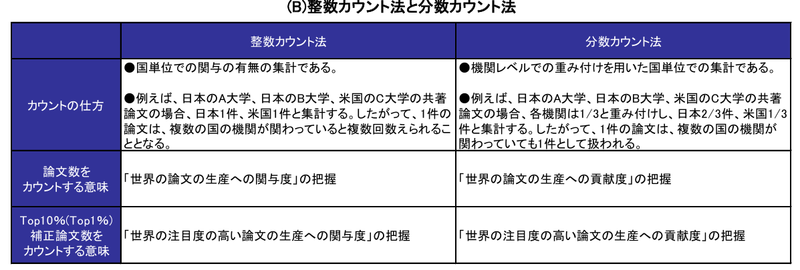
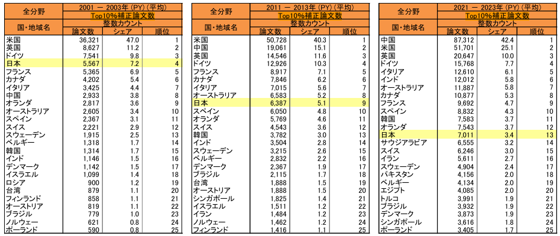

# 日本の研究力・科学力低下について

## 参考

- 公的資料
  - [文部科学省　2021　第１章　我が国の研究力の現状と課題](https://www.mext.go.jp/b_menu/hakusho/html/hpaa202201/1421221_00005.html)
  - [文部科学省 科学技術・学術政策研究所　2025　科学技術指標2025 調査資料-349](https://www.nistep.go.jp/research/science-and-technology-indicators-and-scientometrics/indicators)

- 雑誌記事
  - [読売新聞オンライン　2022　科学論文、トップ１０陥落…大丈夫か、日本の研究開発力](https://www.yomiuri.co.jp/science/20220812-OYT8T50028/)
  - [GIGAZINE　2023　「日本の研究はもはやワールドクラスではない」と科学誌のNatureが指摘](https://gigazine.net/news/20231026-japanese-research-no-longer-world-class/)
  - [中村 祐輔　2025　日本の科学力の低下：批判を受け入れ、失敗を認めなければ再浮上はない！　アゴラ](https://agora-web.jp/archives/250811222658.html)
  - [文春オンライン　2025　ノーベル賞受賞者3氏が緊急会議「日本の科学技術はなぜ苦境に陥ったのか？」坂口志文氏、北川進氏が受賞しても安心できない研究現場の問題点](https://bunshun.jp/articles/-/82643)

## 論文数は多いものの、有力な論文は減少してきている

近年、日本では科学力の低下が問題となっている。科学力を測る有力な指標としてTop10%補正論文数というものがある。これは、Top10％補正論文とは、論文の被引用数が各分野の上位10％に入る論文を抽出し、実数で論文数の1/10となるように補正を加えた論文数を指すものである。この指標を用いることでどれだけ注目度の高い論文の生産に関与または貢献できたかを把握することができる。国・地域別のシェア数を順位付けることによって、世界全体における自国の関与・貢献度が分かる。
日本は年々その順位が下がっており、Top10%補正論文数（分数カウント）において2001年から2003年にかけて25ヶ国中4位であったが、2011年から2013年にかけて7位、そして2025年では13位となった（科学技術・学術政策研究所 2025）。このような科学力の低下の要因は様々である。

なぜ世界の論文の生産に貢献しなければならないのか？
