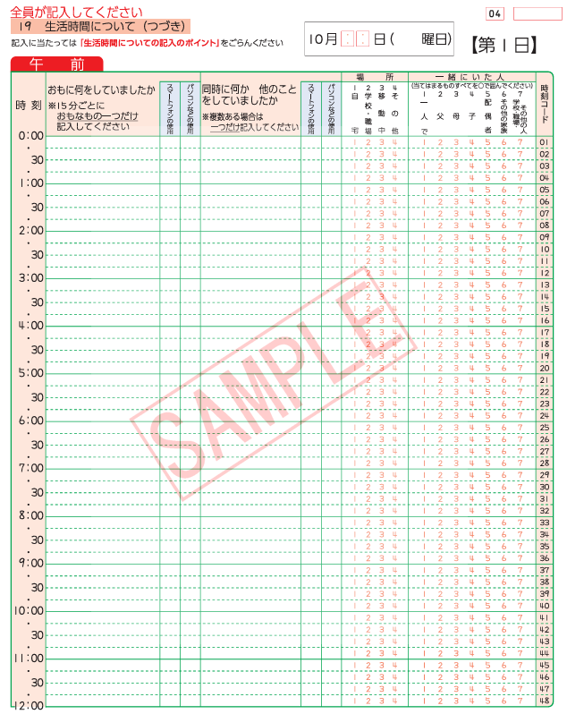

# 調査票の構成

## memo

---

### 議論の進め方

1. 大学教員を取り巻く状況について整理する。
   - 専門業務型裁量労働制の法律と実際のギャップを検討する
   - 業務時間の配分に関するデータを調べる
2. そのような状況は実際にどのような時空間構造を構成させているのかを検討する。
    - 生活日誌による調査
    - インタビューによる調査

### 手法・データ

- **活動日誌**
  - 調査負担：大
  - 大学教員が、日々の活動（教育、研究、会議、事務、プライベートなど）にいつ、どこで、どのくらいの時間を費やしたかを、詳細な粒度（例：15分刻み）で記録したデータ。これにより、それぞれの役割に費やす時間配分と、活動場所（研究室、教室、自宅など）を特定できます。
  - 「研究」、「授業」などの活動項目をどのように分類するのか？
  - 瞬間的な活動はどのように扱うべきか？
    - 例えばニュースを見てたら研究アイデアが浮かんだなど。
    - 15分単位や30分単位といった大きな枠組みにするとか、、、
  - ながら活動はどうする？
    - 研究しながら授業に使う内容を考えている、授業内で学生とディスカッションなど
      - これらはむしろ見る必要がある気もする。
      - というのも、研究-教育が一体となった部分は善いことだと思うから。
  - 少数事例にすべきか
    - フィールドワーク中心の研究をする大学教員を対象とする。
      - 分野間ではなく、大学間の方が比較しやすい気がする、、、
  - その日の研究活動に関する満足度を答えてもらうのもいいかもしれない。
  - 大学教授などは答えてくれないかもしれない…
    - 助教や助手などである若手研究者を対象にするのもありかもしれない
    - 博士課程の人とかも？
      - 若手研究者よりにするならば、不安定な雇用や、若手研究者の不足などとも関係する。

- **詳細インタビュー**: 大学教員に対して、自身の役割認識（教育者 vs. 研究者など）、裁量労働制下での時間管理の工夫、役割間の葛藤やシナジー、特定の空間（研究室、教室など）に対する意識、デジタルツールの利用実態などについて深く尋ねる。

- **エスノグラフィー（行動観察）**: 特定の教員や研究グループの日常的な活動を長期間にわたって観察し、時間と空間の利用パターンや、役割の切り替えの様子を詳細に記述する。

---

### [レジュメ内の研究目的・手法](04_テーマ_科学実践における時空間的な制約.md)

#### 研究の目的

そのような実践に着目するアプローチの一つとして時間地理学が挙げられる．
時間地理学は人々を取り巻く時空間的な制約を明らかにし，その要因について検討していくことが目的である．
また，「諸活動の時空間上の配置をみることにより，異なる活動間の関連性を考察することが可能」（西村 1998）である．
大規模な集団の傾向を明らかにするイメージがあるが，個別性や多様性が広がる中で時間地理学も個人の行動パターンや様々な社会集団ごとの行動パターンの研究もおこなわれてきている（山本 2023：67）．
そのため，実験室研究のような研究者や科学者などの特定の社会集団を対象に分析することは時間地理学の貢献にもつながる．
また，同じ科学実践について分析をおこなう実験室研究とは分析の焦点が異なる．
実験室研究では科学実践の意味やプロセスに焦点を当てるのに対し，時間地理学では科学実践がおこなわれる機会に焦点を当てる．
つまり，「「何ができないか」という「負の決定要因」を見出し，その要因の背景をあぶり出」（岡本 2014）すことに主眼を置いている．
ゆえに，実験室研究などの研究と異なる視点での分析となり，科学実践における新たな知見となる．
さらに，日常的な科学実践の時空間構造を可視化し，その中に潜む制約を見出すという点で科学と空間の関係性を理解するための新機軸になるだろう．
このような新規性から，本研究では時間地理学の視点で研究を行う．
したがって，本研究では，時間地理学の視点から研究者・科学者の日常的な科学実践に着目し，その他の活動との関連性などから時空間的な制約を明らかにする．

#### 研究の対象

本研究では大学教員を対象とする．
研究の背景でも触れた通り，現在の日本において大学教員を含む研究者は様々な問題に直面している．
そうした中で，大学教員は知識生産のみに従事しているのではなく，授業を含む教育活動や講演のような社会貢献活動，教授会などの運営業務など様々な業務に専念している．
そして，そうした多様な業務が近年では多忙化し，研究時間の減少を招くなど知識生産に影響を与えている（文部科学省 2025，木村 2024）．
また，ここに家事や育児などの日常生活に関する活動も絡んでくる．
このように研究者の中でも，大学教員は複雑な時空間パターンを刻んでいるのではないかと考え，研究の対象とした．

#### 研究の手法

時間地理学では主に対象者に活動日誌を記入してもらい，それを基に時空間経路図を作成する．
本研究も同様に大学教員の方たちに活動日誌の記入をしてもらう．
記入する期間は1週間分であり，その月の中で最も忙しい週を記入してもらう．

---

- 社会調査における**コーディング**という概念を理解する必要がある。

## 参考になりそうなもの

- [社会生活基本調査の調査票](https://www.stat.go.jp/data/shakai/2021/gaiyou.html)
  - [調査票AとBの違い](https://www.stat.go.jp/data/shakai/2011/time/index.html)
    - [調査票A](https://www.stat.go.jp/data/shakai/2021/pdf/qua.pdf)
      - [記入のポイント](https://www.stat.go.jp/data/shakai/2021/pdf/pointa.pdf)
      - [回答例](https://www.stat.go.jp/data/shakai/2021/pdf/kaitoua.pdf)
    - [調査票B](https://www.stat.go.jp/data/shakai/2021/pdf/qub.pdf)
      - [記入のポイント](https://www.stat.go.jp/data/shakai/2021/pdf/pointb.pdf)
      - [回答例](https://www.stat.go.jp/data/shakai/2021/pdf/kaitoub.pdf)
- [NHK_国民生活時間調査](https://www.nhk.or.jp/bunken/yoron-jikan/about/summary.html)
  - [行動分類について](https://www.nhk.or.jp/bunken/yoron-jikan/about/classification.html)
  - [調査方法の違い](https://www.nhk.or.jp/bunken/yoron-jikan/about/change-of-method.html)

## 調査票の設計

社会生活基本調査の調査票Bを基に作成する。

- [ ] 科学実践の分類についてを考える
  - インスクリプション概念を理論的支柱にする。
  - 研究の仕方の矢印線をベースとする
- [ ] 場所の分類について考える
- [ ] それ以外の活動をどう記述させるか考える
- [ ] インスクリプションの説明と理論的妥当性について説明する。
