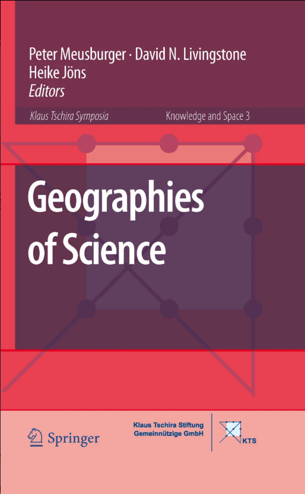

# 人文地理学特論　発表

M1 大塚静空

---

## 選んだ本

### 『Geographies of Science』

- 著者（編者のみ）
  - P. Meusburger
  - D.N. Livingstone
  - H. Jöns
- 出版年
  - 2010
- 出版元
  - Springer Science & Business Media
- その他（巻号など）
  - *Knowledge and Space* vol.3

---

## この本を選んだ経緯

- 自身の研究の学問的（もしくは理論的？）な位置づけとして「科学の地理学（Geographies of Science）」を学びたいから
- 著者の一人であるD.N. Livingstone（以下，リヴィングストン）のある種の応答を見たいから
- 科学の地理学の学際性や事例を知りたいから

---

### 今回発表すること

- そもそも科学の地理学とはどういったものなのか？
  - 日本ではあまり議論されていない分野のため
- そのような内容から再度この本を選んだ経緯について説明
  - 本書を選んだきっかけなどもあるため
- 本書の序文の内容について
  - ここだけでも個人的に収穫があったため

---

## 科学の地理学とは？

- 1995年に提唱され，本格化していくのは2000年代以降
- 科学と空間・場所の関係性について議論を行う研究領域
- サイエンス・スタディーズ（主に科学社会学）と関連
- 学際性の高い研究領域（？）

 

**日本では発展途上の領域**である．
そのため，今回は，この科学の地理学の成立や展開，また上述した科学社会学との関係などを触れたい．

---

### サイエンス・スタディーズとは

- 「科学とは何か」を議論する学際的な研究領域
- 代表的なものとして，科学哲学（Philosophy of Science），科学史（History of Science），科学社会学（Sociology of Science ( and Technology)）

 

科学の地理学は，科学社会学，特に科学知識の社会学（Sociology of Scientific Knowledge（以下，SSK））の影響を受けている．

---

## 科学の地理学の提唱

1995年にリヴィングストンが執筆した「**The Spaces of Knowledge: Contributions towards a Historical Geography of Science**」という論文で提唱された（リヴィングストン 2014:242，Meusburger et.al. 2010:x）．

内容としては，フーコーやサイード，ギアツ，ギデンズ，ハラウェイ，ラトゥールなどの著作を概観し，彼らの思想を基に科学や知識と場所の関係の問題を検討するものである（リヴィングストン 2014:242）．

この論文はまだ未読です（アクセス制限が掛かっているため）．すいません．

---

### 科学の地理学の代表的な書籍

- 『Putting Science in its Place : Geographies of Scientific Knowledge』
- 著者：**David N. Livingstone**
- 出版年：2003年
- 特徴
  - サイエンス・スタディーズにおける**地理学的転回**を目指す
  - **科学のローカル性**に焦点を当てる
  - **歴史事例**を基に議論を進める
- 備考
  - 引用数はこの著作の方が多い
  - 2014年に『科学の地理学 ー場所が問題となるときー』として邦訳

---

### リヴィングストンとはどんな人物か？

- 北アイルランド生まれのイギリス人
- ベルファストのクイーンズ大学で地理学を専攻し，同大学で博士号を取得
  - **歴史にも精通している**
- その後も同大学で**地理学**と**知識史**を教える
- 2007年から2010年まで王立地理学会の副会長を務める

#### 『科学の地理学』を執筆するきっかけ

- もともと地理思想や地理学の発展を社会史や知性史の文脈に位置づける試みがあった
- その過程の中で，逆に**地理学者の視点から科学史を分析することはできるのではないか**という考えから執筆

---

### 科学のローカル性とは？

> 科学的知見は，ローカルなものであると同時にグローバルなものだ．
> （リヴィングストン 2014：ix）

- 「科学」の**一般的な理解**
  - 科学というのは**ローカルな条件に規定されない**普遍的な営み
  - 科学がおこなわれる場所というのは**問題にならない**

- **科学の地理学における理解**
  - > 科学知識は多くのさまざまな場所でつくられている．（リヴィングストン 2014：3）
  - **普遍的な知識となる以前はどうなのか？**
    - 特定の場所で生産された知識がどうして普遍的なのか？
    - 普遍的にするには，どのような努力がなされているのか？

---

#### （例）実験室

- 実験結果に影響を及ぼさないように実験室は場所性を取り除くことは自明である
  - **無場所性の空間**を作らなければならない
  - しかし，地球上にそのようなものはない．
  ⇒**人の手で作らなければならない**

- 客観性や信頼性を獲得するために，こうした空間はどのように構築されるのか？
  - **これは空間・場所が問題となる**

このように科学と空間・場所は何らかの関係性がある．
そのため，**科学が行われる様々な場所を問う必要がある．**
主に局所的でミクロなスケールに注目する

留意として，リヴィングストンは科学知識の妥当性や普遍性などを否定しているわけでない．

---

### 歴史事例の構成

主に3つのテーマに分けて例示される

1. **科学知識が出現する場所**
   - 実験室：知識は地理的特権（実験室に入ることができる）を持つ者に依存
   - 博物館：自然を再構成する場所．特定の見方から展示物をどう配置するのか
   - フィールド作業：徒弟制が不可欠．科学者によってフィールドは構成される
2. **科学や知識を消費する地域**
   - 受容（読書）の地理学：ダーウィンの進化論は地域によって解釈が異なる
3. **知識の流通**
   - 遠方からの知識はどのように信頼されるのか？
     - 地図や図の作成
     - 観察者の訓練

---

### リヴィングストンが提唱した科学の地理学の特徴

- 初期のSSKの性格が強い
  - 初期のSSKでは**歴史研究**の色彩が強い（栗原 2022）
  - 1995年の「The Spaces of Knowledge: Contributions towards a **Historical** Geography of Science」
  - 2003年の『Putting Science in its Place : Geographies of **Scientific Knowledge**』
  - SSKの代表的な科学史家Steven Shapin（以下，シェイピン）に影響を受ける（リヴィングストン 2014：x）

- 考え方
  - SSK：特定の社会・文化状況によって科学知識が構築される
  - 科学の地理学：科学は空間・場所から影響を受ける

---

### シェイピンとの交流

- **SSK側も以前から科学のローカル性や場所性について関心を持っていた**
- シェイピンは1991年に『**The Place of Knowledge**: A Methodological Survey』を執筆
  - これに呼応して，リヴィングストンが1996年の王立地理学会にシェイピンを講演者として招待

⇒このような科学史家との対話は**科学の地理学が成立する背景の一つ**でもあった（Powell 2007）．

 

ここから，科学社会学側での空間・場所への関心について見ていく

---

## 科学社会学における関心

### 科学社会学

- サイエンス・スタディーズの中でも比較的新しい分野
  - 20世紀以降に誕生
- 特徴
  - 科学を社会から切り離されたものとして扱うのではなく，む
しろ**社会的な営み**として位置付けて研究がおこなわれる．
- 様々な分野に派生・展開
  - 科学知識の社会学（Sociology of Scientific Knowledge（以下，SSK））
  - 実験室研究（Laboratory Studies）
  - 科学技術社会論（Science, Technology and Society（以下，STS））

---

### 科学知識と社会・文化状況への関心

1960年代以降，トマス・クーンの『科学革命の構造』におけるパラダイム論がサイエンス・スタディーズに大きな影響を与えた．
これにより，科学社会学は**社会・文化的な条件が科学者の言動だけでなく，科学理論や知識にも影響を及ぼす**と考えるようになった．

こうした関心から，1970年代にSSKが勃興する．

---

### SSK

- **社会構築主義**（**Social Constructionism**）を前提
  - 全ての科学知識は時代状況や特定の社会集団の利害関心などを反映して構築されているという考え方
- 近代科学における**科学知識を対象にイデオロギー分析**をおこなう

---

### リヴァイアサンと空気ポンプ

- 著者：
  - スティーブン・シェイピン
  - サイモン・シャッファー
- 出版年：1985年
- 内容：
  - 17世紀のイギリスが舞台
  - **実験から生まれた知識はどのように信頼されていたのか**が焦点

---

## リヴァイアサンと空気ポンプ

---

## リヴァイアサンと空気ポンプ

---

## リヴァイアサンと空気ポンプ

---

## リヴァイアサンと空気ポンプ

---

### リヴァイアサンと空気ポンプ

17世紀における実験知識は**特定の社会階級の承認**によって正当化，権威付けられていることを明らかにした．

 

また，節々に空間・場所への関心がある．

- 実験室の性質
  - **入りやすい場所に立地**
  - 紳士のみの入館という**地理的特権における不平等**
- 当時の**イギリスという場所における地理的状況**が影響

---

### SSKへの批判

- 資料のつなぎ方次第で社会的影響の強弱を決められる

こうした批判を反論する一方で，「もっとミクロな局面で働く社会的なメカニズムの解明に重点を置く」（松本 2021：41）ようになっていく．

### 実験室研究の誕生

- 1980年代に勃興
- 科学の人類学，科学人類学と称されることも
- **エスノグラフィー**の手法を用いた分析．
  - **実際の実験室**で行われる日常的な活動に注目し，どのように科学知識が作られるのかを記述する
  - 科学実践が行われている**空間**に着目し，どういった意図で建てられているのか，どういった人物がどのような目的で利用しているのかなどを分析する（Stephens and Lewis 2017）

⇒**よりミクロで現実の空間での実践に関心がシフト**

---

### 『ラボラトリー・ライフ』

- 著者
  - ブリュノ・ラトゥール
  - スティーブ・ウール―ガー
- 実験室研究の先駆け
- アクターネットワーク理論の原型
- 内容
  - アメリカのソーク研究所の神経内分泌を研究する実験室に長期間のエスノグラフィーをおこない，**科学知識のどのように構築されるのか**を分析

---

### 『ラボラトリー・ライフ』

- ものを読んだり書いたりする活動から実験や観察から得られたデータを数値化したり図表化したりする活動が行われていることを記述
- 著者らは得られたデータが可視化された数値や表を刻印（inscription）と呼び，そうした刻印が「データを秩序化し実験結果の正当性を他の科学者に認めさせるものとして機能している」（日比野ほか2021：85）を記述

⇒**ミクロな空間の中で実際に行われている科学実践に関心が集まるようになっていた**

---

##### 90年代以降の展開

局所的で，よりミクロな空間に注目していくようになる（日比野 2021）

- 科学以外の知識システムについて議論
  - 土着の知識（indigenous knowledge）
  - 民族的知識（folk knowledge）
- 身体にまでスケールを落とし込むようになる
  - D.Harawayの「状況に置かれた知（SituatedKnowledge）」

### 科学社会学の関心

- 学社会学における空間や場所への関心は明らか
  - **非常にミクロなスケールに注目することが特徴**
  - もちろん，広域的なスケールも扱う（エコロジー問題など）
- 科学社会学における関心は**科学の地理学にとっても見過ごせない**

---

## 科学の地理学の展開

ここで再び科学の地理学に主題を戻す．

### リヴィングストン提唱後の展開

- 2007年に**Richard C. Powell**が雑誌Progress in Human Geography にて『**Geographies of Science :histories, localities, practices, futures**』を出す
  - 内容としては，科学の地理学の成立や科学社会学との関係性についてレビューし，その上で**今後の科学の地理学のあり方について言及**
  - この論文から「**Geographies of Science**」という名称が使用される．
    - この点はリヴィングストンのいう科学の地理学を否定するというよりも，むしろ包含しアップデートする意味合いが強いと考える．

---

### Powell（2007）で挙げられた課題

1. 本質的な部分について
   - 空間が問題であることは述べているものの，
   結局，**場所が科学へどのように作用したのかを述べていない**．
   - 実験室の無場所性の例も，問題になると述べただけで，それ以降どのように構築されているのかには触れていない．
2. 研究アプローチの偏りについて
   - **歴史地理学の研究に偏重している．**
     - 提唱したリヴィングストンが歴史地理学でのアプローチが影響
   - 科学社会学が発展させてきた**実際の科学実践の現場も地理学的に分析すべき**
     - 地理学の科学実践を分析することも提案
   - 「V Futures: beyond historical geographies of science」という章タイトルがあり，歴史地理学への偏りからの脱却が強調されている．

---

### その後の科学の地理学の展開

- **気候変動の知識**への批判
  - 気候変動に関する科学的知識がグローバルであるとされる一方で，その知識の形成と流通には地理的・文化的な偏りがあることを批判（Mahony and Hulme 2016）
- テクノロジーの視点を取り入れた科学の地理学
  - 『Geographies of science **and technology** 1: Boundaries and crossings』(Mahony 2020)
  - **3が2023年に出版される**
- 自然地理学からの視点
  - 『Science studies in physical geography: An idea whose time has come? An idea whose time has come?』（Wainwright 2012）

⇒**欧米では科学の地理学は一つの研究領域となり，現在でも研究が行われている．**

---

## 改めてこの本を選んだ経緯

- 自身の研究の学問的（もしくは理論的？）な位置づけとして「科学の地理学（Geographies of Science）」を学びたいから
- 著者の一人であるリヴィングストンのある種の応答を見たいから
- 科学の地理学の学際性や事例を知りたいから

---

### 自身の研究の学問的な位置づけとして「科学の地理学」を学びたいから

この点は，既述した科学の地理学の展開で2023年にも論文が出ているため，今回選んだ著作だけでなく学問領域として学ぶ必要があると考えている．

まだ科学社会学の内容を含め概説的な理解しかしていないので，こうした専門書などを読む必要がある．

---

### 著者の一人であるリヴィングストンのある種の応答を見たいから

P. Meusbugerはシリーズ全体の編著者的な位置づけのため，実質的な『Geographies of Science』の編者はリヴィングストンとJönsである．

リヴィングストンは序文をJönsと，第1章の1節を自身で執筆しており，本書の重要な位置づけにある人物といえる．

2010年に出版されているため，先ほどのPowell（2007）の論文も読んでいるはずであり，少なくともタイトルもHistoricalを抜いているなど影響を受けていると考える．
そのため，Powell（2007）以降の批判に対する，リヴィングストンのある種の応答・反応として本書を読みたい．

---

### 科学の地理学の学際性や事例を知りたいから

科学の地理学はGeographyではなく，Geographiesと複数形を取っている．
これは科学の地理学を確固たる学問として位置づけるのではなく，様々な視点を取り入れて研究を行う学際領域的なものとして位置づける．

そのため，自分の研究も科学の地理学に取り入れることができるのではないか，と思っている．
本書を読むことで歴史研究以外の事例を知れるかもしれないと考えた．

---

## 文化地理学として判断した理由

本書の紹介文の一部にて

> このエッセイ集は，科学の歴史的および現代の地理の理解を深めることを目的としている．地理学者，社会学者，人類学者，科学史家が追求する科学知識や科学実践への比較アプローチについて，新たな視点を提供する．（発表者が翻訳）

先ほど説明した科学社会学の一連の流れから，社会学者，人類学者，科学史家が追究する科学知識や科学実践という部分は科学を社会的・文化的なものとして扱うことになる．

また，リヴィングストンも「科学は文化を越えるものではなく，文化の一部だということだ．（リヴィングストン 2014：228）」と言及している．

こうした点から文化地理学の延長と捉えることができると判断し，今回選んだ．

---

## 『Geographies of Science』

### 序文：Interdisciplinary Geographies of Science

Interdisciplinaryという単語が使用されており，学際性を強調したタイトルが序文になっている．
この点は，Powell（2007）でも指摘された歴史研究への偏重から脱却し，科学の地理学の学際性の強さを強調していることが分かる．
> 科学知識の普遍性や無場所性の驚きに代わり，科学地理学者は，**科学実践に関する特定の状況**や**科学者，研究資源，アイデアの移転が科学知識の生産や伝達を形成する方法**に焦点を当てる．
> また彼らは，**ある知識の主張についての解釈が異なる時間や場所の中でどのように，そしてなぜ変化するのか**を検討する．
> （Meusburger et.al：ix）

---

> この巻は，**異なる学問分野で活動する研究者たちの対話を通じて**，学際的な科学の地理学をさらに発展させることを目指しており，地理学者，社会学者，歴史学者，人類学者，建築学の研究者といった**多様な視点から科学知識と実践に対する地理的視点の利点を探求する**．（Meusburger et.al：x）

この部分でも同様に学際性が強調されている．
また細かい点ではあるが，「科学知識と実践」を主眼に置いている点も重要である．
リヴィングストンが提唱した時は**知識**のみに主眼が置かれていたが，今回ではそれと同程度に**実践**も視野に入れている．

これは科学の地理学において，知識の変遷や形成過程だけでなく，そうした知識生産を行う科学実践そのものの地理学的な分析も一つのテーマであることが分かる．

---

> 本書は，歴史的および現代的な事例研究をバランスよく提示しており，多くの論文はヨーロッパの実践を中心に扱っている．しかしながら，いくつかの章はグローバルな視点を示し，また別の章ではアフリカの実践やアメリカ先住民の知識を取り上げている．（Meusburger et.al：x）

アフリカの実践やアメリカ先住民の知識を取り上げるという点は，90年代以降の科学社会学の潮流に似たような視点である．
ある意味では近年の科学社会学の関心へ徐々に目が向けられている兆候にも捉えることができる．

---

### 本書のおおまかな構成

1. 比較アプローチ
   - リヴィングストンなどが科学知識に関する様々なアプローチを検討していくような内容．
2. 移動性と中心
   - 歴史事例を基に知識の流通についてを分析するような内容．
3. 知識空間を構築する
   - ミュージアムなどの設計やガーナの知識生産などの実践的な内容．
4. 科学と公共
   - 環境問題に関する知識やレギュラトリー・サイエンスに関する内容．

---

## 参考文献

- 栗原亘編　2022．『アクターネットワーク理論入門　「モノ」であふれる世界の記述法』．ナカニシヤ出版．
- 日比野愛子・鈴木舞・福島真人　2021．『科学技術社会学（STS）　テクノサイエンス時代を渡航するために』．新曜社．
- 松本三和夫 編　2021．『科学社会学』，東京大学出版会．
- リヴィングストン，D.N．著，梶雅範・山田俊弘訳　2014．『科学の地理学　場所が問題となるとき』．法政大学出版局．

---

- Mahony, M., and Hulme, M.　2016．Epistemic geographies of climate change: Science, space and politics: Science, space and politics．Progress in Human Geography 42(3), 395-424．
- Mahony, M.　2020．Geographies of science and technology 1: Boundaries and crossings．Progress in Human Geography 45(3), 586-595．
- Powell, R.C.　2007，Geographies of science: histories, localities, practices, futures．Progress in human Geography 31(3)：309-329．
- Stephens, N. and Lewis, J.　2017．Doing laboratory ethnography: reflections on method in scientific workplaces．Qualitative Research 17(2)：202-216．
- Wainwright, S. P.　2012．Science studies in physical geography: An idea whose time has come? An idea whose time has come? ．Progress in Physical Geography: Earth and Environment 36(6), 786-812．
