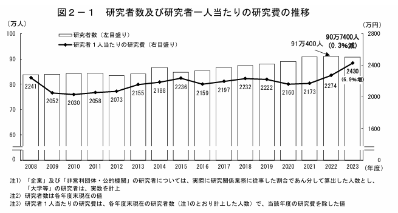
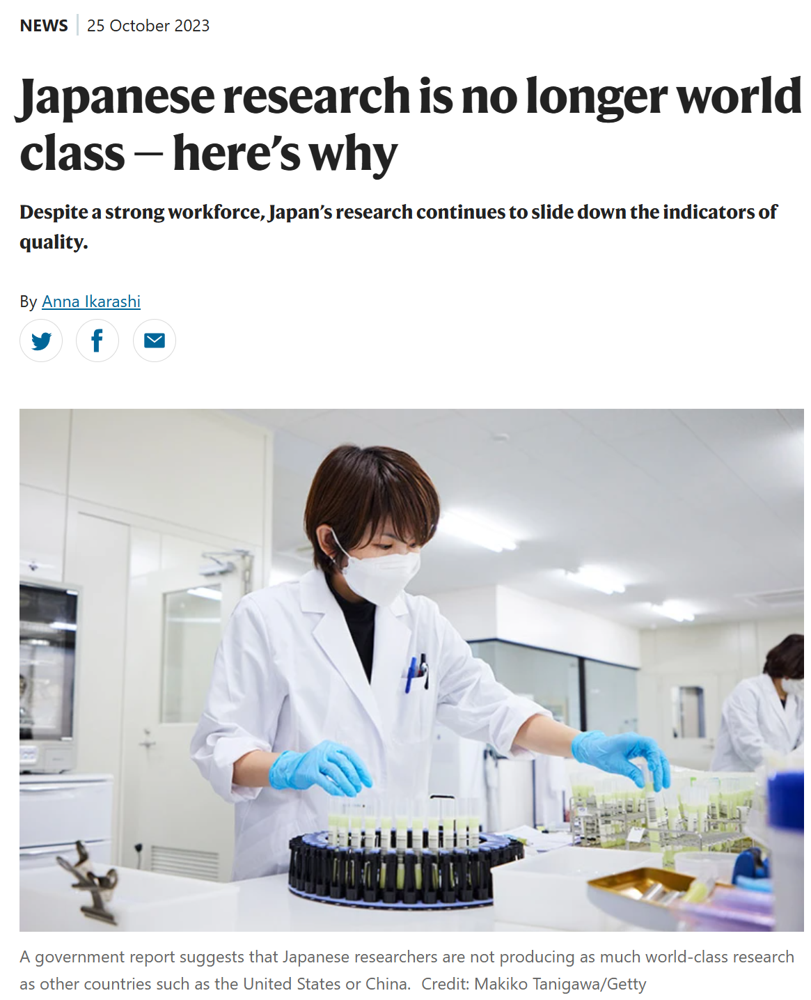
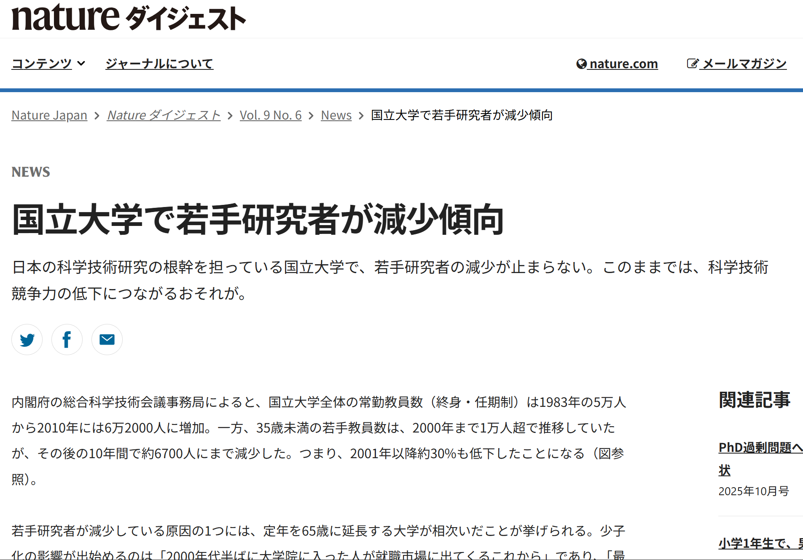
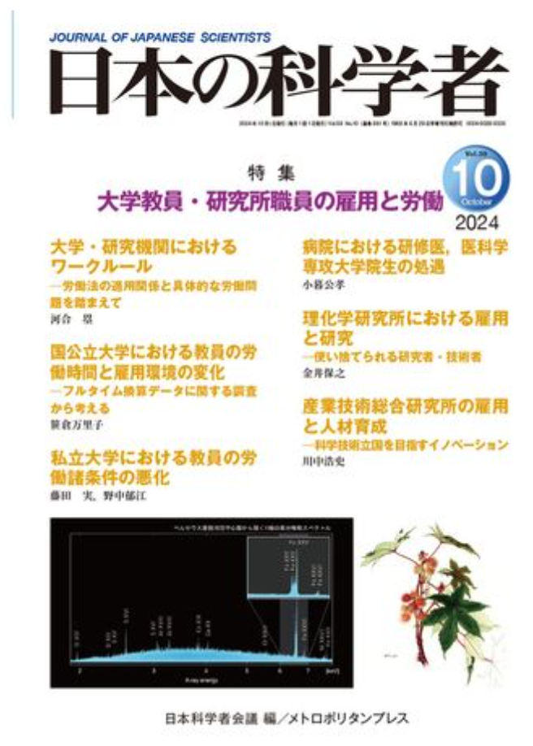
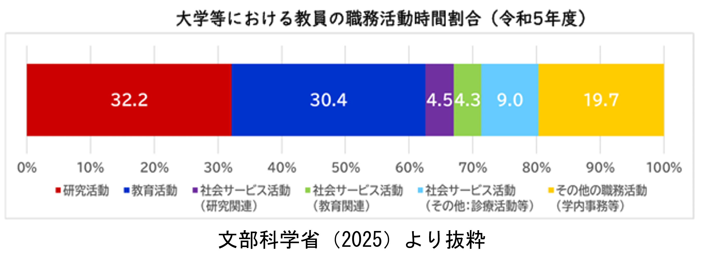

**科学実践における時空間的制約**

ー大学教員を事例にー

 

都市・人文地理学研究室　修士1年　大塚静空

---

## 目次

1. 研究の背景
2. 科学の地理学の視点
3. 研究の目的
4. 研究の対象者
5. 研究の手法
6. 今後やること

---

## 研究の背景

### 科学力の低下

- 近年の日本では科学力は年々低下している。
- 科学技術指標2025では25ヶ国中13位

引用：科学技術・学術政策研究所　科学技術指標2025（全文）p145

---

### 科学力低下の要因

（Ex）

- 若手研究者の不足
- 雇用・労働問題
- 研究時間の不足

etc...

---

### 若手研究者の不足

- 研究者数は横ばいながらも増加している
  - 安定している？

引用：総務省 2024 科学技術研究調査

---

### 若手研究者の不足

- 博士後期課程の進学者は減少傾向
  →大学教員のなり手不足や高齢化

引用：文部科学省 2022 我が国の研究力の現状 博士後期課程の進学

---

### Natureからの言及

- 以下の要因を指摘している
  - 雇用・労働問題
  - 研究時間の不足

---

### 雇用・労働問題

- 2024年に雑誌『日本の科学者』で「大学教員・研究所職員の雇用と労働」というテーマで特集が組まれる。
  - [日本の科学者 2024 59号10巻](https://www.jstage.jst.go.jp/browse/jjsci/59/10/_contents/-char/ja)
- 以下の問題を指摘（河合 2024）
  - 専門業務型裁量労働制
  - 雇止め
  - アカデミック・ハラスメント

---

### 雇用・労働問題

- 研究と生活の両立の難しさが語られるように（岩波書店編集部 2024）

### 研究時間の不足

- テニュア付きのポストに就くも研究以外の業務に忙殺されてしまう（木村 2024）
- 実際に研究時間は5割もない（文部科学省 2025）

---

労働市場などのマクロなスケールから研究時間や生活というミクロなスケールまで**様々な問題が存在し、複雑に絡み合っている**。
こうした社会状況や問題が科学を取り巻いている。

**⇒科学と社会は切っても切り離せない関係となっている。**

 

前出のしたような問題を解決・解消するには、  
**科学と社会の関係性について解明する**必要がある。  
そのような関係性に注目する分野  
↓

**科学社会学（Sociology of Science ( and Technology)）**

⇒次第に**科学と空間・場所の関係性**に注目されるように

---

## 科学の地理学の視点

前述の関心と地理学が結びつき、
1990年代後半に**科学の地理学**（**Geographies of Science**）に発展。

### 科学においても場所は問題になるか？

「科学」の一般的な理解

- 科学というのは**ローカルな条件に規定されない**普遍的な営み
- 科学がおこなわれる場所というのは**問題にならない**

⇒科学の地理学はこうした見方に対して疑義を呈する

**科学においても場所は問題となる。**

---

## 科学の地理学の視点

### （例）実験室　（リヴィングストン 2014：5）

- 実験結果に影響を及ぼさないように実験室は場所性を取り除くことは自明である
  - **無場所性（Placelessness）の空間**を作らなければならない
  - しかし、地球上にそのようなものはない。
  ⇒**人の手で作らなければならない**

- 客観性や信頼性を獲得するために、こうした空間はどのように構築されるのか？
  ⇒**これは空間・場所が問題となる**

### 留意点

こうした見方は科学を否定するものではなく、科学という活動を理解するための研究である。

---

### 科学の地理学の関心

科学の地理学の関心は多様である（日比野ほか 2021，Meusburger et.al 2010）。

1. **科学実践の空間的制約**
科学活動が行われる物理的な空間（実験室、観測所など）や、その空間が置かれた地理的状況（文化、社会制度、時代背景）が、科学実践そのものにどのような影響を与えるのかを研究する。
2. **知識と科学者の移動と伝播**
科学者、アイデア、研究資源、またはテクノロジーが、ある場所から別の場所へ移動・伝播することによって、知識の生産や伝達の過程がどのように形成され、変化するのかを検討する。
3. **科学的知の解釈の変容**
特定の場所で生まれた科学的知識や主張が、異なる時間や場所において、どのように受容され、解釈され、そして変化していくのかという、知識のローカル性を明らかにする。

---

### 課題

Powell（2007）の論文で挙げられた課題

- **科学と場所はどう関係があるかは未説明**
  - 提唱者であるリヴィングストンは**科学にとって場所がどう重要なのかという問いを掲げたものの，答えられていない**と指摘
  - 前述の実験室における無場所性の例も，問題になると述べたものの，実際にどのように構築されているのかには触れていない
- **研究アプローチの偏り**
  - 2000年代初頭の科学の地理学は歴史事例を基にした研究に偏っていると指摘
  - **実際の現場で行われている科学実践の分析の必要性**を指摘

---

## 研究の目的

前述した課題から、本研究では**実際の現場で行われている科学実践**に注目する。

### 時間地理学からのアプローチ

- 実践に着目する地理学的なアプローチの一つとして、**時間地理学**が挙げられる。
  - 時間地理学は人々を取り巻く**時空間的な制約を明らかにし**，**その要因について検討していく**ことが目的
  - 「諸活動の時空間上の配置をみることにより，**異なる活動間の関連性を考察する**ことが可能」（西村 1998）
  - 近年では，個別性や多様性が広がる中で時間地理学も**個人の行動パターン**や**様々な社会集団ごとの行動パターン**の研究もおこなわれてきている（山本 2023：67）

研究者や科学者などの**特定の社会集団を対象に分析することは時間地理学の貢献にもつながる**．

---

### 実験室研究との違い

実験室研究とは、エスノグラフィーを用いて実際の実験室で行われる日常的な活動に注目し，どのように科学知識が作られるのかを記述する研究領域である．

- 分析の焦点
  - 実験室研究：**科学実践の意味やプロセス**
  - 時間地理学：**科学実践がおこなわれる機会**

⇒「「何ができないか」という「負の決定要因」を見出し，その要因の背景をあぶり出」（岡本 2014）すことに主眼を置いている．

そのため、実験室研究とは異なる視点での分析となり、**科学実践における新たな知見となる**。
また、日常的な科学実践の時空間構造の可視化、そしてその構造の中から制約を見出す点で**科学と空間の関係性を理解するための新機軸になり得る**。

---

### 新規性

- 特定の社会集団への行動パターンの分析→**時間地理学への貢献**
- 実験室研究とは異なる視点での研究→**科学実践への新たな見方・知見**
- 時間地理学の視点で実際の科学実践の現場を分析→**科学の地理学への貢献**

上記の点から時間地理学の視点で分析をおこなう。

### 本研究の目的

時間地理学の視点から研究者・科学者の科学実践に着目し，その他の活動との関連性などから時空間的な制約を明らかにする．

---

### 研究の対象者

- 研究の対象者：大学教員
  - 知識生産のみに従事しているのではなく、授業を含む教育活動や講演のような社会貢献活動，教授会などの運営業務など**様々な業務に専念**
    - そのような業務が多忙化し、知識生産に影響あ与えている。
  - 家事や育児などの**日常生活に関する活動**もおこなわれる

⇒研究者の中でも、**大学教員は複雑な時空間パターンを刻んでいるのではないか**と考え，研究の対象とした

---

### 研究の手法

- 時間地理学における代表的な手法
  - 対象者に活動日誌を記入してもらう
  - それを基に時空間経路図を作成する
  - そこから時空間的な制約を検討

これに倣い本研究でも大学教員の方たちに活動日誌を記入してもらう。
記入する期間は**1週間分**であり、**その月の中で最も忙しい週**を記入してもらう。

---

## 今後やること

- 調査票の作成などのデータをどう取得するかを設計する
  - 専門分野によっても変化するなどがあり、大学教員の中でもさらに対象を狭める必要がある→基礎統計などで分析をおこなう
  - 活動日誌の設計をするために、パイロット調査を院生の方に行う可能性があります。
- 先行研究の把握
  - 科学の地理学は基本的に海外文献がメインなので、時間はかかるが近年の動向までをできるだけ正確に把握したい
  - 活動日誌の調査票についての先行例があるかもしれないので、時間地理学に関する文献も読む。

---

**ご清聴ありがとうございました**
