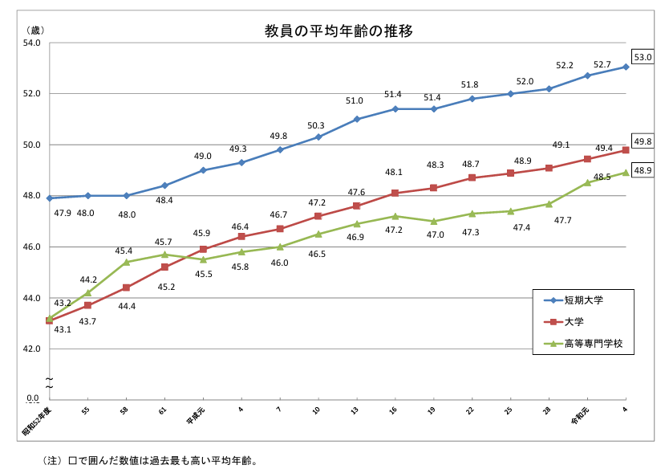
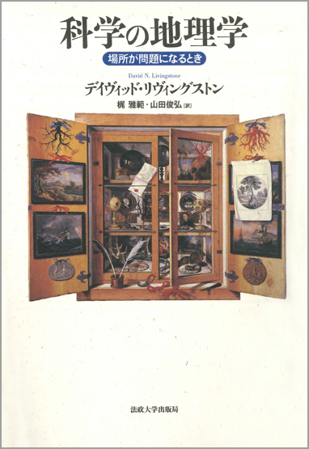
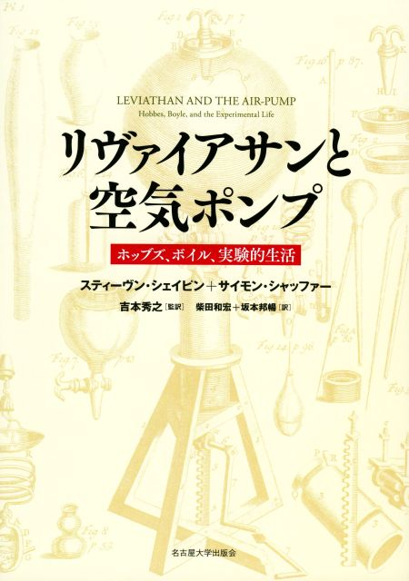
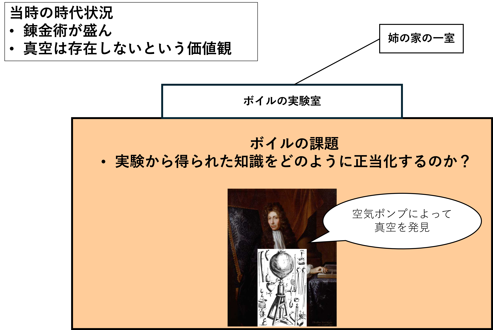
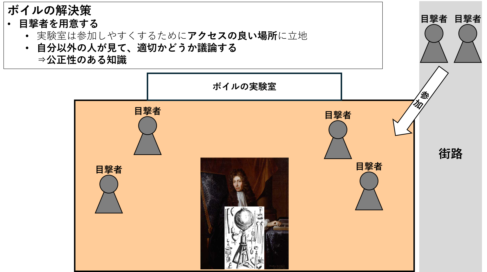
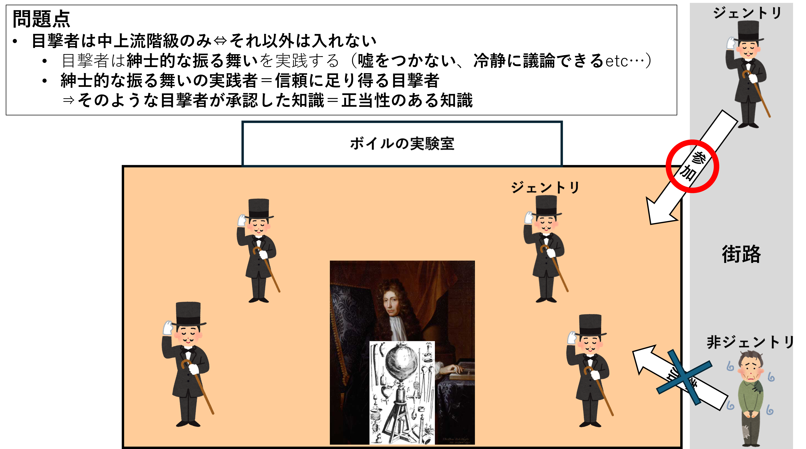
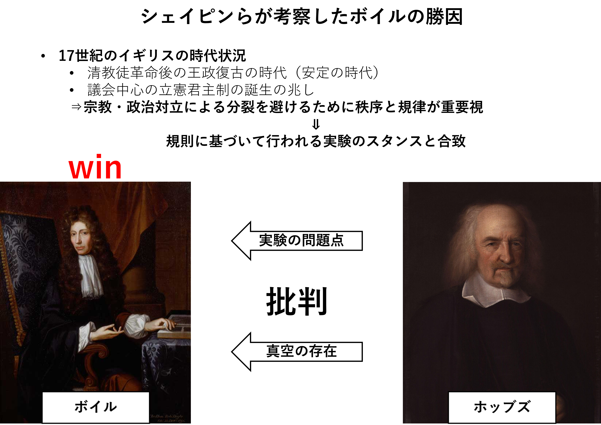
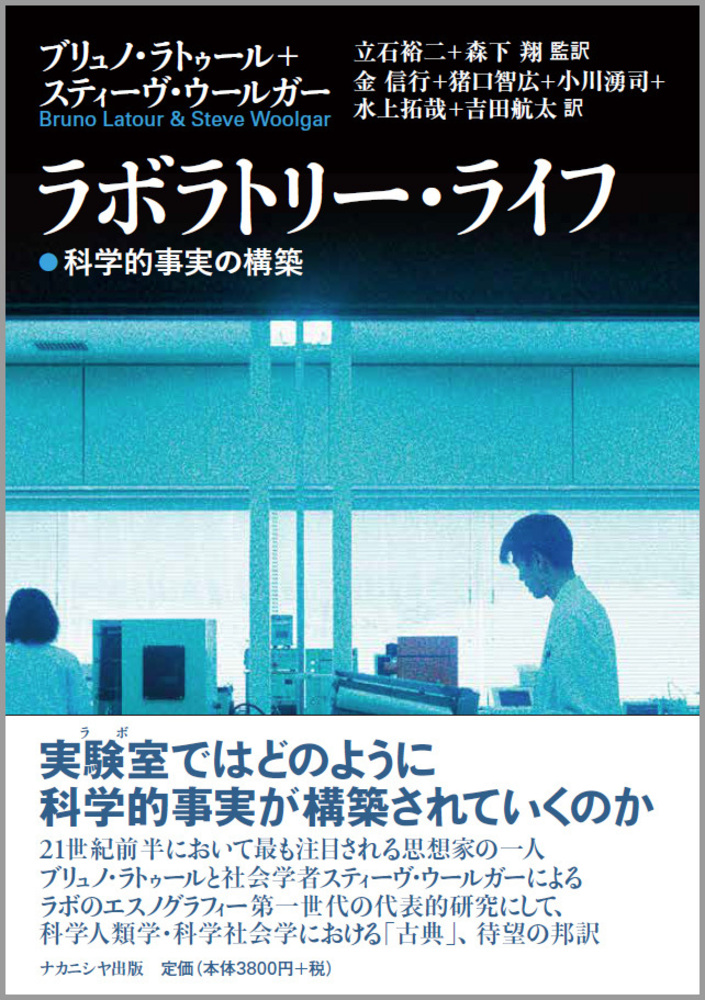

# 10月29日の発表

M1 大塚静空

---

## 前回から現時点で進んだこと

### 研究の方向性が決まる

前回：研究者の労働問題関連  
↓  
現在：科学の地理学（Geographies of Science）  

---

## 前回の疑問点・批判点（2025年月7日）

- **上位の目的が決まっていない（まだ悩み中）**
  - **研究全体の方向性にも関わる**
  - **これがないため、なぜ大学教員を対象とするのか？が位置づけにくい
（レジュメだと唐突に出てきている感が否めない）**
  - 大学教員の時空間構造を把握することが何につながるのか？
  - 現時点では、ただ大学教員を調べた研究であり、範囲が限定的すぎる研究になっている
  - 一応、「労働の地理」における勤務体系と労働者の生活という観点で考え中
- 分野による影響
  - 専門分野によって研究の仕方が異なっているのは先行研究でも述べられている
  - 対象者の問題につながる（一つの分野に絞るのか／複数の分野にするのか）
- 研究の定義
  - >事物・機能・現象等について新しい知識を得るために、又は既存の知識の新しい活用の道を開くために行われる創造的な努力及び探求をいう(総務省 令和6年科学技術研究調査より)
  - 辞書的な意味などを含め決めていきたい

---

## 前回の疑問点・批判点（2025年月7日）

- クリエイティブな活動をどのように生活日誌に落とし込めるのか
  - 時空間の影響を受けるのか？
  - 極論、常に研究のことを考えている人であれば、常に研究していることとなる。
  - むしろ、研究してない部分だけを書いてもらうとか？
- 労働と仕事の違い
  - 調べると哲学の方向に向かってしまうので、正直違いの説明は自信がないです…
  - 少なくとも特定の職業で分類するものではない
  - 研究は労働？仕事？のような問いは個人的にある
  - >この法律で「労働者」とは、職業の種類を問わず、事業又は事務所（以下「事業」という。）に使用される者で、賃金を支払われる者(労働基準法 第9条)
- **時間地理学を応用することは適切か？**
  - 時間地理学の概念として制約があり、人は制約を受けているという受動的な観点
  - 自己の裁量で働くこと、ひいては1日の活動を管理するという能動的なものを見るのに適切か
- **「研究」、「生活」、「労働」のどれをメインにしたいのか（レジュメだと話題が渋滞している）**
  - **研究という行為について話を広げたいのか？大学教員の日常生活について話を広げたいのか？労働問題について話を広げたいのか？**

---

**研究の方向性、自身の研究の学術的な位置づけ**について懸念。  
⇒解消

---

# 日常的な科学実践における時空間的な制約

ー大学教員を事例にー

---

## 目次

1. 研究の背景
2. 科学の地理学の成立から展開
   1. 科学の地理学の成立
   2. 科学社会学における関心
   3. 科学の地理学の展開
3. 研究の目的・背景
   1. 研究の目的
   2. 研究の対象者
   3. 研究の手法

---

## 研究の背景

### 科学力の低下

- 近年の日本では科学力は年々低下している。
- 科学技術指標2025では25ヶ国中13位

引用：科学技術・学術政策研究所　科学技術指標2025（全文）p145

---

### 科学力低下の要因

（Ex）

- 若手研究者の不足
- 雇用・労働問題
- 研究時間の不足

etc...

---

### 若手研究者の不足

- 研究者数は横ばいながらも増加している
  - 安定している？

引用：総務省 2024 科学技術研究調査

---

### 若手研究者の不足

- 博士後期課程の進学者は減少傾向

引用：文部科学省 2022 我が国の研究力の現状 博士後期課程の進学

---

### 若手研究者の不足

- 大学教員は年々高齢化
  - 純粋な少子高齢化
  - 若手研究者の担い手不足

<!-- 引用：文部科学省 2024 学校教員統計 -->

---

### Natureからも言及される

- 以下の要因を指摘している
  - 雇用・労働問題
  - 研究時間の不足
- 引用元
  - [nature](https://www.natureasia.com/ja-jp/ndigest/v9/n6/%E5%9B%BD%E7%AB%8B%E5%A4%A7%E5%AD%A6%E3%81%A7%E8%8B%A5%E6%89%8B%E7%A0%94%E7%A9%B6%E8%80%85%E3%81%8C%E6%B8%9B%E5%B0%91%E5%82%BE%E5%90%91/36741)
  - [natureダイジェスト](https://www.nature.com/articles/d41586-023-03290-1)

---

### 雇用・労働問題

- 2024年に雑誌『日本の科学者』で「大学教員・研究所職員の雇用と労働」というテーマで特集が組まれる。
  - [日本の科学者 2024 59号10巻](https://www.jstage.jst.go.jp/browse/jjsci/59/10/_contents/-char/ja)
- 以下の問題を指摘（河合 2024）
  - 専門業務型裁量労働制
  - 雇止め
  - アカデミック・ハラスメント

---

### 雇用・労働問題

- 研究と生活の両立の難しさが語られるように（岩波書店編集部 2024）

---

### 研究時間の不足

- テニュア付きのポストに就くも研究以外の業務に忙殺されてしまう（木村 2024）
- 実際に研究時間は5割もない（文部科学省 2025）

---

労働市場などのマクロなスケールから研究時間や生活というミクロなスケールまで**様々な問題が存在し、複雑に絡み合っている**。
こうした社会状況や問題が科学を取り巻いている。

**⇒科学と社会は切っても切り離せない関係となっている。**

 

前出のしたような問題を解決・解消するには、  
**科学と社会の関係性について解明する**必要がある。  
そのような関係性に注目する分野  
↓

**科学社会学（Sociology of Science ( and Technology)）**

---

### 科学社会学

- サイエンス・スタディーズの中でも比較的新しい分野
  - 20世紀以降に誕生
- 特徴
  - 科学を社会から切り離されたものとして扱うのではなく，む
しろ**社会的な営み**として位置付けて研究がおこなわれる。
- 様々な分野に派生・展開
  - 科学知識の社会学（Sociology of Scientific Knowledge（以下，SSK））
  - 実験室研究（Laboratory Studies）
  - 科学技術社会論（Science, Technology and Society（以下，STS））

**⇒近年の欧米では、科学と空間・場所の関係性に注目するように**

---

科学と空間・場所の関係性に関する議論は次第に**地理学と結びつく**ようになった。
↓
2000年代初頭　**科学の地理学**（**Geographies of Science**）という研究領域に発展

 

### 科学の地理学における代表的な3つの関心

1. 実験や観察などの科学の活動が行われる物理空間に着目し，**そこで行われる科学実践が空間から受ける影響**について
2. **そのような空間自体がおかれている地理的状況**（土地だけではなく，その土地に根付いた文化や社会制度，時代状況も含む）に注目し，それらが科学実践や科学的知の受容に与える影響について
3. 科学と関連した**テクノロジー**の別の場所への**移転**について

参考：日比野ほか 2021

---

こうした研究領域は欧米において盛んに議論されているが、**日本では未だ発展途上**であり、先行研究も非常に少ない（埴淵 2020）。

埴淵（2020）では、後述する『科学の地理学』を切り口に知識生産と場所の関係は不可分であるとし、大学と地域社会の連携が必要であると論じている。
 

まずはじめに、欧米における**科学の地理学の成立から展開**、そして**科学社会学における空間・場所への関心**について整理する。

---

## 科学の地理学の成立から展開

以下の順で議論を進めていく

- 科学の地理学の**成立**
- **科学社会学における**関心
- 科学の地理学の**展開**

---

### 科学の地理学の成立

- 2003年に出版された書籍『**科学の地理学 ー場所が問題となるときー**』で提唱された
- 著者：**David N. Livingstone**（以下、リヴィングストン）
- 特徴
  - サイエンス・スタディーズにおける**地理学的転回**を目指す
  - **科学のローカル性**に焦点を当てる
  - **歴史事例**を基に議論を進める

---

### そもそもリヴィングストンとはどんな人物か？

- 北アイルランド生まれのイギリス人
- ベルファストのクイーンズ大学で地理学を専攻し、同大学で博士号を取得
  - **歴史にも精通している**
- その後も同大学で**地理学**と**知識史**を教える
- 2007年から2010年まで王立地理学会の副会長を務める

#### 『科学の地理学』を執筆するきっかけ

- もともと地理思想や地理学の発展を社会史や知性史の文脈に位置づける試みがあった
- その過程の中で、逆に**地理学者の視点から科学史を分析することはできるのではないか**という考えから執筆

---

### 科学のローカル性とは？

> 科学的知見は、ローカルなものであると同時にグローバルなものだ。
> （リヴィングストン 2014：ix）

- 「科学」の**一般的な理解**
  - 科学というのは**ローカルな条件に規定されない**普遍的な営み
  - 科学がおこなわれる場所というのは**問題にならない**

- **科学の地理学における理解**
  - > 科学知識は多くのさまざまな場所でつくられている。（リヴィングストン 2014：3）
  - **普遍的な知識となる以前はどうなのか？**
    - 特定の場所で生産された知識がどうして普遍的なのか？
    - 普遍的にするには、どのような努力がなされているのか？

---

#### （例）実験室

- 実験結果に影響を及ぼさないように実験室は場所性を取り除くことは自明である
  - **無場所性の空間**を作らなければならない
  - しかし、地球上にそのようなものはない。
  ⇒**人の手で作らなければならない**

- 客観性や信頼性を獲得するために、こうした空間はどのように構築されるのか？
  - **これは空間・場所が問題となる**

このように科学と空間・場所は何らかの関係性がある。
そのため、**科学が行われる様々な場所を問う必要がある。**
主に局所的でミクロなスケールに注目する

---

### 歴史事例の構成

主に3つのテーマに分けて例示される

1. **科学知識が出現する場所**
   - 実験室：知識は地理的特権（実験室に入ることができる）を持つ者に依存
   - 博物館：自然を再構成する場所。特定の見方から展示物をどう配置するのか
   - フィールド作業：徒弟制が不可欠。科学者によってフィールドは構成される
2. **科学や知識を消費する地域**
   - 受容（読書）の地理学：ダーウィンの進化論は地域によって解釈が異なる
3. **知識の流通**
   - 遠方からの知識はどのように信頼されるのか？
     - 地図や図の作成
     - 観察者の訓練

---

### リヴィングストンが提唱した科学の地理学の特徴

- 初期のSSKの性格が強い
  - 初期のSSKでは歴史研究の色彩が強い（栗原 2022）
  - 原題『Putting Science in its Place : Geographies of **Scientific Knowledge**』
  - SSKの代表的な科学史家Steven Shapin（以下，シェイピン）に影響を受ける

- 考え方
  - SSK：特定の社会・文化状況によって科学知識が構築される
  - 科学の地理学：科学は空間・場所から影響を受ける

---

#### シェイピンとの交流

- SSK側も以前から科学のローカル性や場所性について関心を持っていた
- シェイピンは1991年に『**The Place of Knowledge**: A Methodological Survey』を執筆
  - これに呼応して、リヴィングストンが1996年の王立地理学会にシェイピンを講演者として招待

⇒このような科学史家との対話は**科学の地理学が成立する背景の一つ**でもあった（Powell 2007）。

 

ここから、科学社会学側での空間・場所への関心について見ていく

---

## 科学社会学における関心

1960年代以降、科学社会学は**社会・文化的な条件が科学者の言動だけでなく，科学理論や知識にも影響を及ぼす**と考えるようになった。

レジュメに記載していないがトマス・クーンの『科学革命の構造』が大きく影響している。
パラダイムシフトなどの概念がここから出てくる。

こうした関心から、1970年代にSSKが勃興する。

---

### SSK

- **社会構築主義**（**Social Constructionism**）を前提
  - 全ての科学知識は時代状況や特定の社会集団の利害関心などを反映して構築されているという考え方
- 近代科学における**科学知識を対象にイデオロギー分析**をおこなう

シェイピンとサイモン・シャッファーが執筆したSSKの代表的な著作『**リヴァイアサンと空気ポンプ ―ホッブズ，ボイル，実験的生活―**』を事例にSSKの考え方を理解していく。

---

#### リヴァイアサンと空気ポンプ

- 著者
  - スティーブン・シェイピン
  - サイモン・シャッファー
- 出版年　1985年
- 内容
  - 17世紀のイギリスが舞台
  - **実験から生まれた知識はどのように信頼されていたのか**が焦点

---

## リヴァイアサンと空気ポンプ

---

## リヴァイアサンと空気ポンプ

---

## リヴァイアサンと空気ポンプ

---

## リヴァイアサンと空気ポンプ

<!--
規律は、誰でも目撃し、再現できる点
秩序は、議論による承認
勝つというより現代ではおかしいの点が多くあるのにも関わらず、社会状況によって受容・正当化されたというイメージ
-->

---

### リヴァイアサンと空気ポンプの結果

17世紀における実験知識は**特定の社会階級の承認**によって正当化、権威付けられていることを明らかにした。

 

また、節々に空間・場所への関心がある。

- 実験室の性質
  - 入りやすい場所に立地、
  - 紳士のみの入館という地理的特権における不平等
- 当時のイギリスという場所における地理的状況が影響

---

##### SSKへの批判

- 資料のつなぎ方次第で社会的影響の強弱を決められる

こうした批判を反論する一方で，「もっとミクロな局面で働く社会的なメカニズムの解明に重点を置く」（松本 2021：41）ようになっていく。

### 実験室研究の誕生

- 1980年代に勃興
- **エスノグラフィー**の手法を用いた分析。
  - **実際の実験室**で行われる日常的な活動に注目し、どのように科学知識が作られるのかを記述する
  - 科学実践が行われている**空間**に着目し，どういった意図で建てられているのか，どういった人物がどのような目的で利用しているのかなどを分析する（Stephens and Lewis 2017）

⇒**よりミクロで現実の空間に関心がシフト**

---

### 『ラボラトリー・ライフ』

- 著者
  - ブリュノ・ラトゥール
  - スティーブ・ウール―ガー
- 実験室研究の先駆け
- アクターネットワーク理論の原型
- 内容
  - アメリカのソーク研究所の神経内分泌を研究する実験室に長期間のエスノグラフィーをおこない，**科学知識のどのように構築されるのか**を分析

---

### 『ラボラトリー・ライフ』

- ものを読んだり書いたりする活動から実験や観察から得られたデータを数値化したり図表化したりする活動が行われていることを記述
- 著者らは得られたデータが可視化された数値や表を刻印（inscription）と呼び，そうした刻印が「データを秩序化し実験結果の正当性を他の科学者に認めさせるものとして機能している」（日比野ほか2021：85）を記述

⇒**ミクロな空間の中で実際に行われている科学実践に関心が集まるようになっていた**

---

##### 90年代以降の展開

局所的で、よりミクロな空間に注目していくようになる

- 科学以外の知識システムについて議論
  - 土着の知識（indigenous knowledge）
  - 民族的知識（folk knowledge）
- 身体にまでスケールを落とし込むようになる
  - D.Harawayの「状況に置かれた知（SituatedKnowledge）」

### 科学社会学の関心

- 学社会学における空間や場所への関心は明らか
  - **非常にミクロなスケールに注目することが特徴**
  - もちろん、広域的なスケールも扱う（エコロジー問題など）
- 科学社会学における関心は**科学の地理学にとっても見過ごせない**

---

## 科学の地理学の展開

ここで再び科学の地理学に主題を戻す。

### リヴィングストン提唱後の展開

- 2007年にRichard C. Powellが雑誌Progress in Human Geography にて『Geographies of Science :histories, localities, practices, futures』を出す
  - 科学の地理学の成立や科学社会学との関係性についてレビューし，その上で**今後の科学の地理学のあり方について言及**

---

### Powell（2007）で挙げられた課題

1. 本質的な部分について
   - そこで何が起きていたのかは記述しているが、
   結局、**場所が科学へどのように作用したのかを述べていない**。
   - ボイルの実験室の例も、あくまで実験室という場所で起きた社会的な作用を述べただけで、実験室が科学知識に与えた影響などは言及されていない。
2. 研究アプローチの偏りについて
   - 歴史地理学の視点での研究に偏っている
   - 科学社会学が発展させてきた**実際の科学実践の現場も地理学的に分析すべき**
     - 地理学の科学実践を分析することも提案
   - 「V Futures: beyond historical geographies of science」というタイトルからも分かるように歴史地理学のみの研究にならないようにすることが重要

⇒このような課題から、本研究では**実際の科学実践の現場を地理学的に分析する**ことに焦点を当て、研究を進める。

<!-- Whatはできてるが、Howがない -->

---

### その後の科学の地理学の展開

- 気候変動の知識への批判
  - 気候変動に関する科学的知識がグローバルであるとされる一方で，その知識の形成と流通には地理的・文化的な偏りがあることを批判（Mahony and Hulme 2016）
- テクノロジーの視点を取り入れた科学の地理学
  - 『Geographies of science and technology 1: Boundaries and crossings』(Mahony 2020)
  - 3が2023年に出版される
- 自然地理学からの視点
  - 『Science studies in physical geography: An idea whose time has come? An idea whose time has come?』（Wainwright 2012）

⇒欧米では科学の地理学は一つの研究領域となり、現在でも研究が行われている。

---

## 研究の目的・手法

### 研究の目的

- 実践に着目する地理学的なアプローチの一つとして、**時間地理学**が挙げられる。
  - 時間地理学は人々を取り巻く**時空間的な制約を明らかにし**，**その要因について検討していく**ことが目的
  - 「諸活動の時空間上の配置をみることにより，**異なる活動間の関連性を考察する**ことが可能」（西村 1998）
  - 個別性や多様性が広がる中で時間地理学も**個人の行動パターン**や**様々な社会集団ごとの行動パターン**の研究もおこなわれてきている（山本 2023：67）

実験室研究のような研究者や科学者などの**特定の社会集団を対象に分析することは時間地理学の貢献にもつながる**．

---

### 実験室研究との違い

科学実践を分析する際に競合するのが実験室研究であるため、実験室研究との違いを述べる

- 分析の焦点
  - 実験室研究：**科学実践の意味やプロセス**
  - 時間地理学：**科学実践がおこなわれる機会**

⇒「「何ができないか」という「負の決定要因」を見出し，その要因の背景をあぶり出」（岡本 2014）すことに主眼を置いている．

そのため、実験室研究とは異なる視点での分析となり、**科学実践における新たな知見となる**。
また、日常的な科学実践の時空間構造の可視化、そしてその構造の中から制約を見出す点で**科学と空間の関係性を理解するための新機軸になり得る**。

---

### 新規性

- 特定の社会集団への行動パターンの分析→**時間地理学への貢献**
- 実験室研究とは異なる視点での研究→**科学実践への新たな見方・知見**
- 時間地理学の視点で実際の科学実践の現場を分析→**科学の地理学への貢献**

上記の点から時間地理学の視点で分析をおこなう。

#### 研究目的

時間地理学の視点から研究者・科学者の日常的な科学実践に着目し，その他の活動との関連性などから時空間的な制約を明らかにする．

---

### 研究の対象者

- 研究の対象者：大学教員
  - 知識生産のみに従事しているのではなく、授業を含む教育活動や講演のような社会貢献活動，教授会などの運営業務など**様々な業務に専念**
    - そのような業務が多忙化し、知識生産に影響あ与えている。
  - 家事や育児などの**日常生活に関する活動**もおこなわれる

⇒研究者の中でも、**大学教員は複雑な時空間パターンを刻んでいるのではない**かと考え，研究の対象とした

---

### 研究の手法

- 時間地理学における代表的な手法
  - 対象者に活動日誌を記入してもらう
  - それを基に時空間経路図を作成する
  - そこから時空間的な制約を検討

これに倣い本研究でも大学教員の方たちに活動日誌を記入してもらう。
記入する期間は**1週間分**であり、**その月の中で最も忙しい週**を記入してもらう。

---

# おわりに

---

## 反省、懸念、感想

- で、データはどう取るの？
  - 面目ないです
  - 今回は科学の地理学という分野の理解、そもそも位置づけられるのかに不満を覚えたので、このような先行研究の整理にシフトしました。（言い訳がましくなりますが）
  - 手法について未だ具体的に考えられていないので、今回発表することができませんでした。
  - 実証系で論文を書くならデータがないと始まらないことは理解しています…
  - 一応、院生の方にドラフト調査をしようかと思っています。（その時は是非ともよろしくお願いいたします）
  - 結局、ここが今一番の不安な点です。
- まだ概説的な理解でしかなく、専門的な内容に踏み込めていない
  - 元々この分野に興味はあったものの、専門的にやるとは思ってもみなかったので、これから勉強していきます。
  - 専門書もまだ読めてない…『ラボラトリー・ライフ』とか…
  - 間違っている点や誤解している点もあると思います。
  - 今回どんな文献を読んだらいいかなどがある程度つかめた点は収穫かなと思っています。
  - この点は、やっていて楽しいので一応問題ないと思っています。

---

## 反省、懸念、感想

- なんで方向性が決まったのか？
  - 調べていくうちに、別に労働問題に対して物申したい訳ではないことが分かりました。
  - 振り返ってると、科学とは何だろうか？や、研究ってどういう活動なのか？というような興味が元々あり、そこに時間地理学の視点を取り入れると面白いのでは？という発想になったのがきっかけでした。やはり、こっちを知りたいとなり、方向性が決まりました。（田中先生のお力添えもあります）
  - また、労働問題でいくのは立場的に不適切であると感じました。
  - 要は当事者でもない人間が物申すというのはおかしいということです。
- 科学実践ではなく、研究活動でよくない？
  - 一応、科学社会学系の研究では科学実践（Scientific Practice）の方を採用しており、また科学の地理学でも使用されているので、今回は科学実践にしました
- 日常的な科学実践があるなら、非日常があるの？
  - ここでの「日常的」というのは、Ordinary や Daily というよりも、In everyday (life)のようなニュアンスです。（正直、痛い質問です）
  - 時間地理学の視点にもあるように断片的に活動を捉えるのではなく、日常生活を送る中でおこなう様々な活動の一つという意味合いが近いかなと思っています。

---

## 反省、懸念、感想

- 大学教員を対象とする理由がまだ弱い
  - ここは検討中なので、まだ答えが出ません
- 科学を否定したいのか？
  - 陰謀論的なものではなく、「科学という活動を知りたい」というポジティブなものだと個人的に思っています。
  - また、リヴィングストンも普遍的な知識が存在しないと言っているわけでなく、どうやって普遍的になるのか？ということを問題にしています。
- リヴィングストンの文献に関して
  - 日本でも邦訳版というよりも原著などの海外文献での引用はありました。
  - しかし、地理思想や哲学の研究であり、また科学の地理学以前に書いた（90年代くらい）、どちらかというと地理思想関連の文献が引用されてました。そのため、今回は発表に入れませんでした。（本当に軽くしか読んでいないのもあります）
  - 調べるうちに個人的に、日本ではリヴィングストン・ベースの科学の地理学で止まっているという印象を持ちました。

---

## 反省、懸念、感想

- いっそのこと展望論文にした方が…
  - そもそも日本であまり発展していない中で、さらに新しいことをやるのは渋滞しすぎな気も。
  - ついでにデータの制約からも解放される…
- SSKに苦戦
  - 理解するのに手こずりました（現在進行形）
  - 今回の発表で「リヴァイアサンと空気ポンプ」がやたら長かったのも、このせいです。
  - これもまだ邦訳本すら読めていないので、本質的な部分が理解できていない。
  - サイエンス・ウォーズとかも控えていると思うとゾッとします。
- 少数サンプル→理論・フレームワークで論じる
  - おそらく、このようなタイプの論文になるかと思われます。
  - とはいえ、どんな理論・フレームワークを使用するのかも未定です。
  - このような論じ方をする論文を読んで書き方を学ぼうと思っています。

---

# おわり
