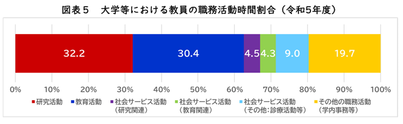

# 大学教員の日常生活における時空間構造

大塚 静空

---

## 発表内容

1. はじめに
   1. フレキシブルな労働の拡大
   2. 労働者としての大学教員
   3. 研究時間の不足
   4. 大学教員という存在
   5. 大学教員の生活実態
2. 問題意識
   1. 大学教員の生活における時空間構造
   2. どこで研究をしているのか
3. 今後の予定
4. 現時点での課題点・批判点

---

# 1 はじめに

---

## フレキシブルな労働の拡大

- 働き手の価値観の変化や，デジタル技術の進展，労働力不足への対応，最近では新型コロナによる在宅勤務の普及といった背景を基にフレキシブルな労働形態が拡大している。
- そのような動きは専門・技術職にも浸透している。

---

## 労働者としての大学教員

- フレキシブルな労働の一つとして裁量労働制がある
  - 日本の裁量労働制では企業型と専門業務型の2種類がある
  - その中でも専門業務型は19の職種に限られた裁量労働制である。
- 大学教員は専門業務型裁量労働制に該当する
  - 国立大学の多くが採用

---

## 労働者としての大学教員

### 専門業務型裁量労働制とは？

- 特定の業種に限られている （例えば、新聞記者、SE、弁護士 etc）
  - 主に専門・技術的職業従事者がこれに当たる
- みなし労働時間による勤務体系が特徴である
  - 所定の時間だけ働いたとみなして賃金を支払う仕組み
  - 必要以上に働いても、以下に働いても給与は同じ
  - 割増賃金が支払われることも

---

## 労働者としての大学教員

### 専門業務型裁量労働制のメリット・デメリット

- メリット
  - 好きな時間に出勤し、退勤することが出来る
  - 時間の調整がしやすく、仕事と家庭が両立しやすい
- デメリット
  - 全て自己管理が必要
  - 長時間労働が起きる
    - 高度な業務が立て続けにくることなどが要因
    - 一方で働き損になってしまう
    - 国立大学教員は依然として長時間労働である（笹倉 2024）

---

## 労働者としての大学教員

### 大学教員の雇用管理の実情

- 前述のように専門業務型裁量労働制の対象である
- 実際に大学全体では専門業務型を採用している大学は少ない
  - 研究などの業務を行っているのかを組織が判断することが難しいたため
  - 実情はみなし労働時間をベースとしたグレーな裁量労働である

---

## 研究時間の不足

- 昨今、日本の研究力低下が指摘されている（文部科学省 2022）
- 原因として、研究時間の不足が挙げられる

- 研究時間の不足は外国語論文の生産が高いグループに強くみられる（伊藤 2012）
  - 論文が評価され、地位向上による業務の増加を示唆
- 役職が上がるにつれ管理業務が多くなる（木村 2024）

---

## 大学教員という存在

- 現在、大学教員は3つの役割を担っている
- 家庭生活の文脈を入れた場合、保護者や介護者にもなる
          

<!-- 画像挿入 -->
- 大学教員は常に業務を行っているわけではなく、日常的な生活も行っている
- 日常生活全体の構造を把握するべきである

---

## 大学教員の生活実態

- 大学教員を対象とした研究は複数存在している
（加藤 2003；伊藤 2012；渕上・杉田 2021；笹倉 2024）

- しかし、日常生活に範囲を広げた研究は管見の限りみられない
  - 書籍では『研究者、生活を語る』がある
    - 様々な領域の研究者が自身の生活について語るといった内容
      - ライフステージの変化とフィールドワークの実施タイミング
      - キャリアを優先し海外に赴任すべきか

---

# 2 問題意識

---

## 大学教員の生活における時空間構造

- 先行研究では意識調査による分析や時間収支による分析が行われているが，時空間的な視点での分析を行った研究は見られない．
- 日常生活まで範囲を広げた研究はみられない
- そこで、本研究では**時空間的な視点から大学教員の日常生活**を明らかにしたい
  - 時空間構造を把握するため時間地理学を応用

    

（時間地理学とは）
人々の日常的な生活行動を時間と空間の配置として捉え，
そこに潜む時空間上の制約を明らかにすることを目指している。

雇用体系が労働者の時空間を変容させることを明らかにした研究がある（西村 1998）

<!-- 時空間経路図の画像を挿入する -->

---

## どこで研究しているのか

- 現在、どこでも研究をすることが可能となっている
- 労働が自分の裁量に委ねられている大学教員にとって，
自身のスケジュールを管理することは必須の作業である．
- そのような自己管理を行うとき，
大学教員はどこを研究する場として設定するのか又はせざるを得ないのか

---

## 今後の予定

### 1年次

- 文献調査
- 生活日誌の設計

### 構想発表までに行いたいこと

- 研究の目的の明確化
- 研究方法の具体化

---

# 4 現時点での課題点・批判点

---

## 現時点での課題点・批判点

- 上位の目的が決まっていない（まだ悩み中）
  - 研究全体の方向性にも関わる
  - これがないため、なぜ大学教員を対象とするのか？が位置づけにくい
（レジュメだと唐突に出てきている感が否めない）
  - 大学教員の時空間構造を把握することが何につながるのか？
  - 現時点では、ただ大学教員を調べた研究であり、範囲が限定的すぎる研究になっている
  - 一応、「労働の地理」における勤務体系と労働者の生活という観点で考え中
- 分野による影響
  - 専門分野によって研究の仕方が異なっているのは先行研究でも述べられている
  - 対象者の問題につながる（一つの分野に絞るのか／複数の分野にするのか）
- 研究の定義
  - >事物・機能・現象等について新しい知識を得るために、又は既存の知識の新しい活用の道を開くために行われる創造的な努力及び探求をいう(総務省 令和6年科学技術研究調査より)
  - 辞書的な意味などを含め決めていきたい

---

## 現時点での課題点・批判点

- クリエイティブな活動をどのように生活日誌に落とし込めるのか
  - 時空間の影響を受けるのか？
  - 極論、常に研究のことを考えている人であれば、常に研究していることとなる。
  - むしろ、研究してない部分だけを書いてもらうとか？
- 労働と仕事の違い
  - 調べると哲学の方向に向かってしまうので、正直違いの説明は自信がないです…
  - 少なくとも特定の職業で分類するものではない
  - 研究は労働？仕事？のような問いは個人的にある
  - >この法律で「労働者」とは、職業の種類を問わず、事業又は事務所（以下「事業」という。）に使用される者で、賃金を支払われる者(労働基準法 第9条)
- 時間地理学を応用することは適切か？
  - 時間地理学の概念として制約があり、人は制約を受けているという受動的な観点
  - 自己の裁量で働くこと、ひいては1日の活動を管理するという能動的なものを見るのに適切か
- 「研究」、「生活」、「労働」のどれをメインにしたいのか（レジュメだと話題が渋滞している）
  - 研究という行為について話を広げたいのか？大学教員の日常生活について話を広げたいのか？労働問題について話を広げたいのか？
