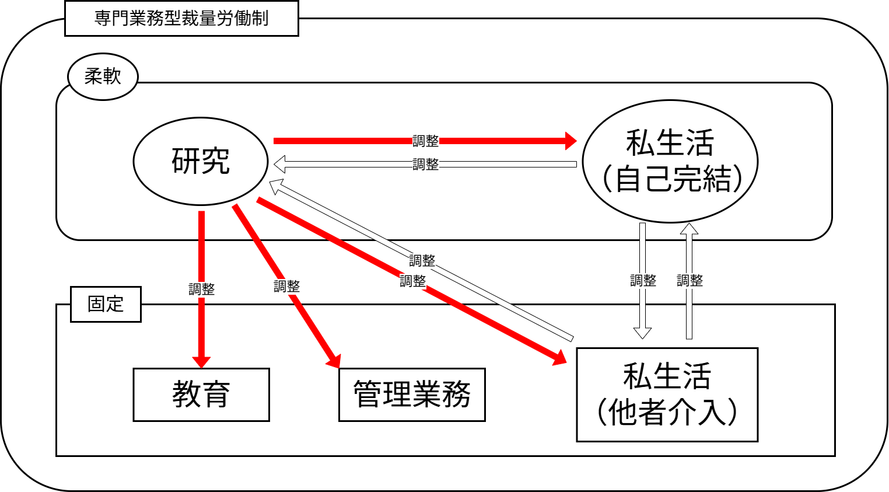

# 大学教員の多様な役割と時空間的実践に関する研究

## Index

- [大学教員の多様な役割と時空間的実践に関する研究](#大学教員の多様な役割と時空間的実践に関する研究)
  - [Index](#index)
  - [メモ・疑問](#メモ疑問)
    - [研究者の生活を取り上げる理由](#研究者の生活を取り上げる理由)
    - [本研究の全体像](#本研究の全体像)
    - [大学教員の研究時間の不足に関する考察](#大学教員の研究時間の不足に関する考察)
    - [田中先生の研究計画書の構成をみる](#田中先生の研究計画書の構成をみる)
      - [社会的背景](#社会的背景)
      - [学術的背景](#学術的背景)
      - [目的：背景を踏まえ、この研究で何をするかを示す](#目的背景を踏まえこの研究で何をするかを示す)
      - [研究方法](#研究方法)
      - [調査分析方法](#調査分析方法)
  - [リサーチ・クエスチョン？](#リサーチクエスチョン)
  - [関係するかもしれない学問](#関係するかもしれない学問)
  - [コアになるかもしれない文献](#コアになるかもしれない文献)
    - [論文](#論文)
    - [書籍](#書籍)
  - [現時点で分かること（先行研究的な部分）](#現時点で分かること先行研究的な部分)
  - [研究方法](#研究方法-1)
    - [議論の進め方](#議論の進め方)
    - [手法・データ](#手法データ)
  - [批判](#批判)

---

## メモ・疑問

- 大学に留まりながらでも研究は可能な時代。（なんかここら辺を強調したいのかな自分）
  - 大学教員が研究者や教育者、管理・事務従事者が混在した状態で働くことが出来るのはデジタル技術に依存しているのではないか？
  - パソコンで会議も出来てしまうし、海外の最新の論文も読めてしまう、研究室から出ることなく研究をすることが可能であり、それ故に大学に留まり続けても大きな支障がない。
    - 研究者自らがテクノクラート的支配に巻き込まれているとも捉えられる？（ちょっと理解が浅い？）
  - 一つの空間に留まりながらもデジタル技術により様々な活動が可能となることで、制約を受けた空間においても一定の水準の活動を行うことができる。
    - [テーマ案_非移動性の地理学](03_テーマ案_非移動性の地理学.md)とも関連する。
  - 機械に依存しているとも考えられる？
    - [テーマ案_機械の時間地理学](03_テーマ案_機械の時間地理学.md)
    - しかし、そのようなデジタル技術に依存した状態は本質的に解決しているといえるのだろうか？

- フィールド調査に制限が掛かっている
  - 制約は特にない
  - 長期間の休みのタイミングのみ
  - 現地に行く機会が減っているのではないか？

- 大学教員は研究、教育、事務、家事・育児という多様な役割の中にいる。
  - 多くの大学教員を対象とした研究や研究活動に関する研究はあくまで業務時間内の話であり、1日のリズムの中で行われている研究活動ではない。

- 忙しすぎて、現地調査の時間が短くなる上に、ゆとりがない調査になってしまうのではないか？
  - 調査にゆとりや遊びがなくなるとどうなる？

- 研究活動に関する問題の多くは時間に焦点が当てられている。
  - 時間は何故無いのか？
    - 業務の増加
    - 厳しい評価主義のまん延
    - 資金獲得への奔走
- では、「空間」は問題にはならないのか？
  - それとも扱う意味がない？
- 「空間の問題」にも色々ある。
  - 大学からの通勤距離
  - 都心と地方の大学の格差（就職や、研究施設の充実さ）
  - **自分は「どんな空間の問題」を扱いたいのか？**
    - 少なくともスケールはミクロなスケールである。

- 大学教員の裁量労働制
  - [専門業務型裁量労働制](./02_専門業務型裁量労働制とは.md)の一種である。
  - 時間の調整はOK、空間の調整はNo
    - 少なくとも、[都立大学の裁量労働制の規則](https://bunnkei-kanribu.jim.tmu.ac.jp/shomu/discretionarylabor/)ではそのようである。
  - >つまり、時間と空間は共に有限であるが、活動者が保持できるのは時間のみであり、空間は保持できるとは限らない。（[時間地理学とは](./02_時間地理学とは.md)）
  - すでに権威の制約のような部分は垣間見えている

- 研究は空間的にどうあるべきか？
  - 問題にならないのなら、常に大学に留まって行うべきなのか。

- 生活日誌で何を示したいのか？
  - 空間も問題であるということ
    - ちょっと曖昧

- 研究時間を確保すれば、質の良い研究が出来るのか？
  - 研究時間が問題となっているのであれば、時間さえ解消すれば問題ないのか？
  - 研究時間を確保することが私的時間や家事育児の時間にまで侵食していくのではないか？

- FTEデータでも指摘されているとおり、いつデータを取るかが重要である。
  - 授業のある日、ない日、長期休業期間の3時点でFTE調査は行われている。

- 労働問題として位置付けたいのかというとそうではない。
  - どちらかというと「研究」という活動が労働の地理や教育の地理のように、何かしら空間的な作用を受けているのではないかという位置づけ。
  - つまり、研究活動において空間はどのような影響を与えているのか、を明らかにしたい。
  - 特定の活動を対象として、それらにおける空間性を明らかにするという動き地理学の研究において一般的である。
    - 例えば、仕事の地理学、教育の地理学、サービスの地理学など
      - 各地理学の特徴や概念を具体的に例示する。
  - このように活動と空間は一定の関係が認められる。
  - であれば、「研究」という活動においても何らかの関係性があるのではないだろうか。

- 研究に重点を置くのも悪くはないが、仕事とケアなどをどのように調整しながら研究者は生活を行っているのかを見るべき？（こっちの方も大事かな）
  - やはり、ワークライフバランスという観点は見過ごせないと思う。
  - それこそ、[西村論文](https://www.jstage.jst.go.jp/article/jjhg1948/50/3/50_3_232/_article)のように夫婦間での時空間構造を比較することで、仕事とケアの調整を担っているのかという視点で捉えることもできる。
  これを大学教員の生活に当てはめてみるのはどうだろうか？
  - 研究第一主義でいいのか？という研究目的でもいいかもしれない。
    - 「**研究者として成功したいのであれば、家事やケアを最大限外部化（外注化）して、研究の時間を確保すれば成果を出せる**」（岩波書店　2024）→これが正解なのか？
    - 質の良し悪し関係なく研究はされており、実際に論文の数は増えているが、研究時間がひっ迫しているのも事実である。
    対策として研究時間の確保が優先されていき、家庭内時間が減少していく又は外注化されていくのではないか？
    この場合だと、研究者の働き方そのものは変わることなく、全て自己責任のもとセルフマネジメントがすべてになる。
    研究者の労働構造が変化しないことは良いことなのか？
    - 研究者を対象とした研究において業務内での分析だけでなく、日常生活にまで対象を広べるべき示唆になる。

- 研究の地理というある種新しい地理学を生み出すうえで、既存の活動－空間を対象としてきた地理学のテーマがどのような概念や特徴を持っているのかを整理することで新しい領域を生む手掛かりになる。

- 生活が研究に対する負の決定要因として扱わないようにする。
  - 時折、そういった感じになってしまうの気を付けるように！
  - 「研究者の生活」にどういった負の決定要因があるのかを明らかにするイメージ！（これをテーマにした方がいい！！）
  - 「研究が～」は捨てて、「研究者の生活が～」で考えるように！

---

### 研究者の生活を取り上げる理由

研究活動と空間の関係性を明らかにする上で、研究者の生活の中で研究活動がどのように営まれているのかを分析する。
まず、研究活動を断片的なもとして考えるのは適切でなく、むしろ生活全体の一部として扱い、研究者の生活の中にどのように組み込まれているのか、その他の活動とどのように関連しているのかを、、、

また、研究活動と空間の関係性を明らかにする研究は非常にフロンティアな領域である。
仕事の地理学（geography of work）などの特定の活動と空間の関係性を明らかにする研究分野は多く存在するが、研究活動について取り扱った研究は管見する限り見られない。
直接的な先行研究は見当たらないため、本研究のみでその関係性を明らかにすることは難しく、誤った結果を生まざるを得ない。
そのため、研究活動を取り巻く状況、つまり研究者の生活を対象とすることで、研究活動と空間から研究活動を伴った日常生活と空間に範囲を広げる。
日常生活について扱った研究は豊富に存在するため、それらを足掛かりにすることで議論が円滑になると考える。

研究者も一人の人間であり、研究以外の日常的な活動も行っている。
そのため、研究を断片的な活動として捉えるのは適切でなく、むしろ生活全体の一部として扱い、日常的な活動とどのように連鎖しているのかを分析すべきである。

研究者も日常生活を営む人間であり、研究活動を生活の一部として捉えることに問題はない。
むしろ、研究活動を断片的に考えて分析する方が適切とはいえないだろう。

---

### 本研究の全体像

研究と空間の関係性を修士論文一本で論じるというのは不可能であり、そもそもそんなに薄くて分かりやすい関係でもない。
簡単な話、仕事と空間について論文一本で示すことが出来ると思うだろうか。
しかも、とてつもない知識量や経験があるわけでもない人間に。
研究（活動）という事象は抽象度が高く、高次元なものである。
なので、それを目的にするというのは無理があるし、やったとしても結局のところ誤った、もしくは煩雑な結果を生んでしまう。
したがって、研究と空間の関係性については今後の最終目標と位置づけ、研究（活動）という高度なものを直接取り扱うのではなく、まずは研究（活動）を取り巻く事象について扱った方が手が付けやすいと考える。
そして、その研究を取り巻く事象の一つとして研究者の生活があり、さらにその具体例として大学教員の生活がある

- 最終目標：研究（活動）と空間の関係性の解明
  - 中間？目標：研究を取り巻く事象と空間の関係性の解明
    - 研究を取り巻く事象の例
    - 研究者の生活
      - 研究者の生活の事例
        - 大学教員の生活

上記のような全体像を旨に進めていくといいかもしれない。
なので、「研究」を対象にするのではなく、「研究活動を含んだ日常生活」を対象にするイメージで考えるといいかもしれない。

タイトル的には、「研究者の時空間構造と制約　－大学教員の生活行動を事例に－」のような形になると考える。

---

### 大学教員の研究時間の不足に関する考察

専門業務型裁量労働制の下で働いている大学教員の構造として時間の調整がしやすいというメリットがあるものの、一方で研究時間が不足しているという事態も起きている。
そのような事態については文科省のFTEデータや先行研究などで明らかになっている。
であれば、時間の調整がしやすいというメリットは本来、研究活動が曖昧で突発的だからこそ、それを管理する側は管理をしやすくするために、大学教員側は研究をしやすくするために（「しやすさ」については少し曖昧…）、存在している。
しかし、研究資金獲得などの理由で教育活動や管理業務、さらに社会貢献は増加傾向にある。
これらの活動は、他者との調整が必要なため、研究活動に比べて非常に固定的なものである。
それ故、多くの固定的な業務を遂行するために、他者との調整があまり必要でない研究活動が調整する側に回ってしまう。
これが研究時間の減少や確保の要因であると考える。
つまり、研究活動を支えるための柔軟さが研究活動を阻害しているのだ。

また、私生活にまで焦点を広げるのであれば、調整のしやすい活動と調整のしにくい活動がさらに増える。
「寝食を忘れ研究に励む」といった具合に食事や睡眠といった自己管理は調整がしやすく、一方で子供の送迎や親の介護などの他者が介入する活動は調整がしにくいといえる。



---

### [田中先生の研究計画書](../Data/記入例(論文計画書その2_概要).pdf)の構成をみる

意外と具体的な対象地域などの細かい部分は書かれてはいない。

#### 社会的背景

> 現代においては，障がい者の円滑な移動を保障する環境整備が重要な課題となっている．世界各国ではバリアフリー関連の法律が施行され，その下でバリアフリー政策が実施されてきた．しかし，そうした政策の効果については検討の余地がある．先進諸国では公共事業費削減，規制緩和，ボランタリズムの推進によってバリアフリー整備が実施されづらく，バリアフリー化の対象が特定の空間に集中してしまうという問題が生じている．（約197字）

社会の中で起きている問題や事象についてを端的に示している。
極端に具体的（例えば、○○町ので～があった。）な事例を記述するのではなく、どういった事象なのかを記述しているような感じ。

自分の場合で置き換えると、「東京都立大学の大学教員は～」にするのではなく、「国公立大学の大学教員は～」や「研究者の多くは～」のような形で考える。

```text

近年、働き方やワークライフバランスが語られるようになり、その潮流は研究者の生活にも訪れている。
理研の雇止め問題のような労働市場におけるマクロな課題だけでなく、特に昨今では研究と生活の両立の難しさや大学の法人化に伴う業務の多忙化などのミクロな課題が露わとなっている。
研究者として成功するためには研究成果を出さなければならないが、他の業務から研究時間を確保することは難しいために私生活を削って捻出するといった問題も起きている。

```

#### 学術的背景

> 障がいに関する地理学的研究では，上述の問題は政策的排除 policy exclusion の一種として議論されてきた．それは，社会的包摂を企図する政策が，かえって排除を導いてしまうという問題である．たとえば，イギリスの障害者差別禁止法／平等法による規制や合理的配慮が限られた空間でしか機能していないことや，日本のバリアフリー新法の下でのバリアフリー整備が特定の空間でしか実施されていないことが先行研究によって指摘されている．（約212字）

社会的な問題や事象を学術ではどう議論しているのかを示し、その例について簡単に触れている。
大事なのは、地理学の中でどう議論しているのかを示すこと。
議論されていない場合は、「○○学などでは～と議論されているが、地理学においてはまだ発展途上である。」みたいにするとか？
ここで社会的な事象を学術の中に落とし込むと同時に、自分の研究が何の学問の流れに位置づけられるのかを示しているため、この部分が計画書の中で一番重要だと思う。

自分の場合に置き換えると、「日常生活の制約について議論をする時間地理学では～」や「仕事に関する地理学では～」みたいにして、何らかの議論されていることを示す。

#### 目的：背景を踏まえ、この研究で何をするかを示す

> バリアフリー新法で定められている重点整備地区に注目し，日本のバリアフリー政策の課題を考察する．重点整備地区は，短期的かつ効率的にバリアフリー化を進めるために特定の空間に投資を集中させる方法であり，政策的排除を引き起こす危険性がある．本研究ではその実態を明らかにする．

何があるのかを明らかにするという実態解明の形を取っている。
これ以降もそうだが、具体的に詰めていくよりも全体の流れを重視して書かれている。

```text
研究とそれ以外の業務やライフイベントとの調整のしづらさを改善する必要があるということは、そのような研究と生活の両立の難しさが時空間的にどのように現れているのかを明らかにする。
専門業務型裁量労働制という労働構造が実際の大学教員の生活をどのように構成させているのか、これを主なリサーチ・クエスチョンとして研究を進める。
```

#### 研究方法

> 政策的排除を鍵概念として，以下の流れで議論を進める．①バリアフリー新法の枠組みを調査し，重点整備地区の設定という方法に内在する問題について検討する．②その問題が実際に生じる可能性を検討する．③実際にどのような問題が起こっているかを検討する．

最初に計画上での問題点を整理して、次にじゃあ実際に起きる可能性があるのかを検討し、最後に実際に起きている問題を考察している。
目的を基に作成しており、計画上の問題点、実際の問題点という2つの側面から議論を進める形にしているのではないか。
計画上の問題が実際にどのような形で表れているのか、というような形で実態を明らかにするという目的と合致させている。

```text
まず、時間地理学の理論的枠組みを使用して、議論を進める。①専門業務型裁量労働制の法律と実際のギャップについてを検討する。
```

#### 調査分析方法

> ①行政資料をもとに，国が想定する重点整備地区の設定方法がどのようなものかを検討し，そこには問題があることを指摘する．②東京都を事例に，生活関連施設と重点整備地区の関係を，GISを用いた空間分析で検討し，国の想定に当てはまる／当てはまらない施設がどの程度存在するかを確認する．③国の想定から外れてしまっている場所（政策的排除が生じている場所）を利用している障がい者への聞き取り調査と，現地の観察調査を通じて，具体的問題を明らかにする．

研究方法で示した議論の流れを基に各項目で具体的に何をするのかを示している。

---

## リサーチ・クエスチョン？

- 専門業務型裁量労働制という労働構造が実際の大学教員の生活をどのように構成させているのか？
  - 大学教員の職階に応じて、その時空間構造にどのような違いがあるのか？
  - 研究活動のデジタル化が、既存の制約環境を助長しているのではないか？

- フィールドワーク中心の研究者

---

## 関係するかもしれない学問

大学教員ないし研究者がどのように空間を利用しているのかについてを分析するため、空間的実践に関する地理学を採用するといいかもしれない。

- **時間地理学**: 個人の活動の制約と可能性を時間・空間の観点から分析する手法として確立されており、本テーマの基礎となり得る。生活の中で「何ができないか」を分析し、その要因について考察をしていく。
- **文化地理学**：こちらも時間理学と同様に空間的実践を扱う地理学である。研究活動を文化活動として扱うという点では、若干『ラボラトリー・ライフ』的な感じになるかもしれない。
- **労働の地理学**: 大学教員の労働実態、特にワークライフバランスや裁量労働制に関する研究は、社会学や労働経済学の分野で先行研究がある可能性がある。地理学においても、特定の職業集団の労働空間や移動パターンに関する研究は存在する。
- **科学の地理学**：科学的知識と空間・場所性との関係について述べられている。研究者の生活という意味では意に反するが、最終的に研究と空間の関係性について触れる時に重要な視点になるかもしれない。

## コアになるかもしれない文献

### 論文

- [西村雄一郎　1998　自動車製造業の生活の時空間変化　人文地理50(3)：232-255](https://www.jstage.jst.go.jp/article/jjhg1948/50/3/50_3_232/_article/-char/ja)
  - 【理由】
    - 時間地理学の視点で行われている。
    - 仕事と家庭などの活動間の調整が描かれている。
  - 【メモ】
    - この論文では明確に労働体制が変化した影響を調査しているが、自分の研究の場合だとそういった大規模な生活の影響がないので、「変化」を分析することは難しいかもしれない。
- [山本 理佳　2023　COVID-19以後の観光研究における時間地理学／リズム分析の意義と可能性　観光学評論11(1)：61-72](https://www.jstage.jst.go.jp/article/tourismstudies/11/1/11_61/_article/-char/ja/)
- [山本理佳　2023　COVID-19以後の観光研究における時間地理学／リズム分析の意義と可能性　観光学評論11(1)：61-72](https://www.jstage.jst.go.jp/article/jjet/44/4/44_44090/_article/-char/ja/)

### 書籍

- [岩波書店編集部　2024　『研究者、生活を語る　－「両立」の舞台裏』　岩波書店](https://www.iwanami.co.jp/book/b652391.html)
  - 【理由】
    - 研究者の生活をダイレクトに扱っている。
    - 研究等の業務以外の私生活との葛藤が描かれている。
    - 時間のみだが、スケジュールが書かれている。
    - 研究者たちが「研究と生活の両立」を**どうにかやっている**という状況が強調されている。
  - 【メモ】
    - 時空間的視点で考えるとどうなるのかが気になるので、それを自分の研究で行うという感じかな？
    - 正直、事例に対しての総括をする最終章のみを読むだけで十分だと思う。
      - とはいえ、女性研究者についての話が多いので、フェミニズム地理学っぽくなるような気もする…
- [木村幹　2025　『国立大学教授のお仕事　－とある部局長のホンネ』　筑摩書房](https://www.chikumashobo.co.jp/product/9784480076793/)
  - 【理由】
    - 大学教授の業務の多忙さについてエッセイ風に綴られている。
    - 業務だけでなく、大学内部の組織体制等も書かれている。
  - 【メモ】
    - 私生活への言及が少ない。

---

## 現時点で分かること（先行研究的な部分）

- **時間地理学の応用**: 時間地理学は、個人の日常活動や時間配分を空間的な制約と関連付けて分析する手法として確立されており、特定の職業集団の活動パターンを分析する研究は存在します。大学教員を対象とした研究も、労働社会学や高等教育研究の分野で行われている可能性があります。
- **大学教員の裁量労働制の現状**：目的と現状をみると限界であるといえる。大学教員に裁量労働制が適用された理由は研究活動への従事であるにもかかわらず、実際は大学改革等により研究活動が満足にいかない現状である。  
加えて、裁量労働制は時間の調整は可能であるものの、空間の調整がしにくいというのが現状である。例えば、子供の送り迎えが必要であるため、保育所の近くにあるカフェで業務を行うなどが空間の調整の一例である。現状では、自宅で業務を行うにも申請が必要というものである。。

- [裁量労働制に関する先行研究](https://cir.nii.ac.jp/articles?q=%E8%A3%81%E9%87%8F%E5%8A%B4%E5%83%8D%E5%88%B6&count=20&sortorder=4&hasLinkToFullText=true)

- 研究者のワークライフバランス
  - 渕上 ゆかり, 杉田 菜穂, 大学教員のワーク・ライフ・バランス実態と求められる職場環境改善支援, 日本教育工学会論文誌, 2020, 44 巻, 4 号
    - > 大学所属研究者である大学教員の本分が教育と研究の双方であることはもちろんであるが，研究以外の業務過多やライフイベントにより研究活動・研究意欲を妨げられている状況を改善し，集中して研究に取り組めるような環境整備を進めることが求められている．
    - 上記のような課題を挙げているが、研究とそれ以外の業務やライフイベントとの調整のしづらさを改善する必要があるということは、**そのような研究と生活の両立の難しさが時空間的にどのように現れているのかを自分の研究ではやるべき！！**
    - この両立の難しさを明確にした研究がない→先行研究の課題
  - [藤本哲史](https://www.jil.go.jp/institute/zassi/backnumber/2009/special/pdf/014-029.pdf)

- 日本の労働の地理学だと、労働市場の分析や地域の労働力といった方向性が強いので、裁量労働制を対象としたことを分析していない。
  - 海外だとどうだろうか？

<!-- - **役割葛藤・役割距離**: 社会学の分野では、複数の役割を持つ個人が経験する役割葛藤や、ゴフマンの提唱する役割距離に関する研究が蓄積されている。これについては、特にフィールドワークと生活をどう両立するのかという部分である。
- 地理学的な視点での新規性: 既存研究は多いものの、「教育者」と「研究者」という特定の二重性に焦点を当て、その役割が「大学」という同一の物理的空間でどのように時空間的に実践され、互いに影響し合うのかを詳細に分析する地理学的な研究は、まだ十分ではない可能性があります。特に、空間利用の微視的な側面や、役割間の動的な切り替えに時間地理学を適用する点は新規性を見出せるでしょう。 -->
<!--
知識生産に関する？論文
- (https://doi.org/10.1002/geo2.38)
- (https://doi.org/10.1111/tesg.12435)
- (https://doi.org/10.1080/00045608.2015.1072791)
- (https://doi.org/10.1002/geo2.8) -->

- **研究時間に関する話は多い**：時間の問題は多いが、空間・場所に関する話は少ない。

---

## 研究方法

### 議論の進め方

- 専門業務型裁量労働制の法律と実際のギャップを検討する

### 手法・データ

- **活動日誌**
  - 調査負担：大
  - 大学教員が、日々の活動（教育、研究、会議、事務、プライベートなど）にいつ、どこで、どのくらいの時間を費やしたかを、詳細な粒度（例：15分刻み）で記録したデータ。これにより、それぞれの役割に費やす時間配分と、活動場所（研究室、教室、自宅など）を特定できます。
  - 「研究」、「授業」などの活動項目をどのように分類するのか？
  - 瞬間的な活動はどのように扱うべきか？
    - 例えばニュースを見てたら研究アイデアが浮かんだなど。
    - 15分単位や30分単位といった大きな枠組みにするとか、、、
  - ながら活動はどうする？
    - 研究しながら授業に使う内容を考えている、授業内で学生とディスカッションなど
      - これらはむしろ見る必要がある気もする。
      - というのも、研究-教育が一体となった部分は善いことだと思うから。
  - 少数事例にすべきか
    - フィールドワーク中心の研究をする大学教員を対象とする。
      - 分野間ではなく、大学間の方が比較しやすい気がする、、、
  - その日の研究活動に関する満足度を答えてもらうのもいいかもしれない。

- **詳細インタビュー**: 大学教員に対して、自身の役割認識（教育者 vs. 研究者など）、裁量労働制下での時間管理の工夫、役割間の葛藤やシナジー、特定の空間（研究室、教室など）に対する意識、デジタルツールの利用実態などについて深く尋ねる。

- **エスノグラフィー（行動観察）**: 特定の教員や研究グループの日常的な活動を長期間にわたって観察し、時間と空間の利用パターンや、役割の切り替えの様子を詳細に記述する。

---

## 批判

- そもそも研究者や研究活動は空間的に自由であるべきなのか？
  - 研究者自信が特段不自由を感じていないというのであれば、それは制約として扱っていいのかという理由。
  - *知識創発の場*が失われている。
    - ひらめき、セレンディピティが無くなる。
    - しかし、これは偶発的なものであり再現性がないため、セレンディピティが生まれる瞬間を扱った研究も基本的にない。
  - 大学側としては空間的に自由だと管理しにくい。
    - 『人間の領域性』を読んでみるのも悪くない？
    - しかし、昨今のホワイトカラーはフリーアドレスなどの一定の自由さが確保されている。
  - > とりあえず質問への回答は、「個人的には自由に研究したい」です。大前提として、研究活動は自由に行われる「べき」でしょうし、多くの研究者がそれが理想だと思っているでしょう。しかし「現実問題」として、好き勝手にいろいろな場所で研究を行うことはできません。私個人の考えとしては、重要なのは規範的・理想的な「べき論」ではなく、「実際に」どのくらい自由に活動できるか、研究活動を促進・制限しているものは何かだと思います。（田中先生のメールより）

- 実際に地理学者などのフィールドワーク中心の研究者は何度も現地に足を踏み入れているのか？それとも1~2回くらいか？
  - 人によると思うが…

- 坪本先生：裁量労働制を問題にする時に自己責任論にならないのか？
  - [ここで応答](./01_裁量労働と自己責任論.md)する。

- 坪本先生：学内にいなければならない理由の一つとして、学生の安全などがある。
  - そのような「いなければならない」や「仕方がない」という状況を把握することこそが時間地学の目的の一つである。

- 「結局、人による」という結果になるのか？
  - 時期にもよると思う。

- 最終目標が研究と空間の関係性について明らかにする中で、研究者の生活を何故取り上げる必要があるのか？

- 研究者の中で何故、大学教員を選んだのか？
  - なぜフィールドワーク中心の人を？

- 裁量労働制だけが問題なのか？
  - それは業務または研究活動を主軸に考えた場合であり、研究者の生活という文脈では他にも要因があると思う。

- 大学教員の業務については調査されているるけど、生活まではしていない。

- 大学ってどんな場所？
