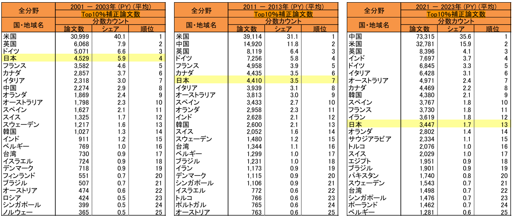
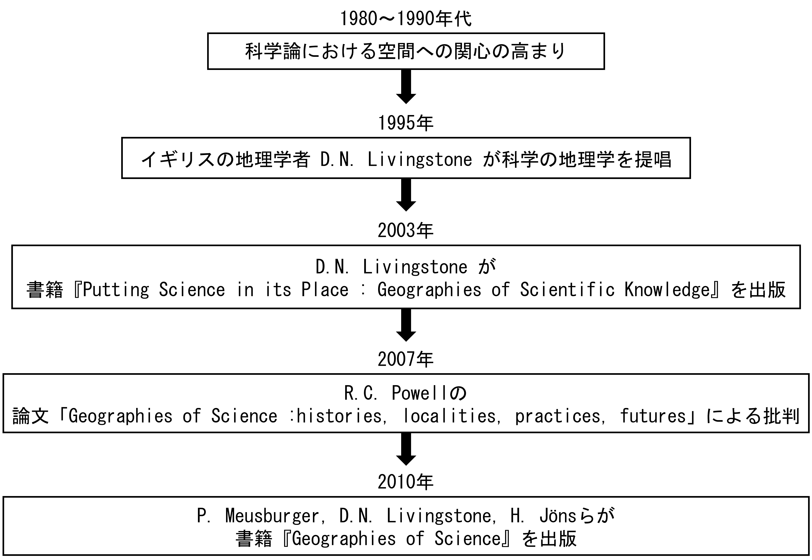
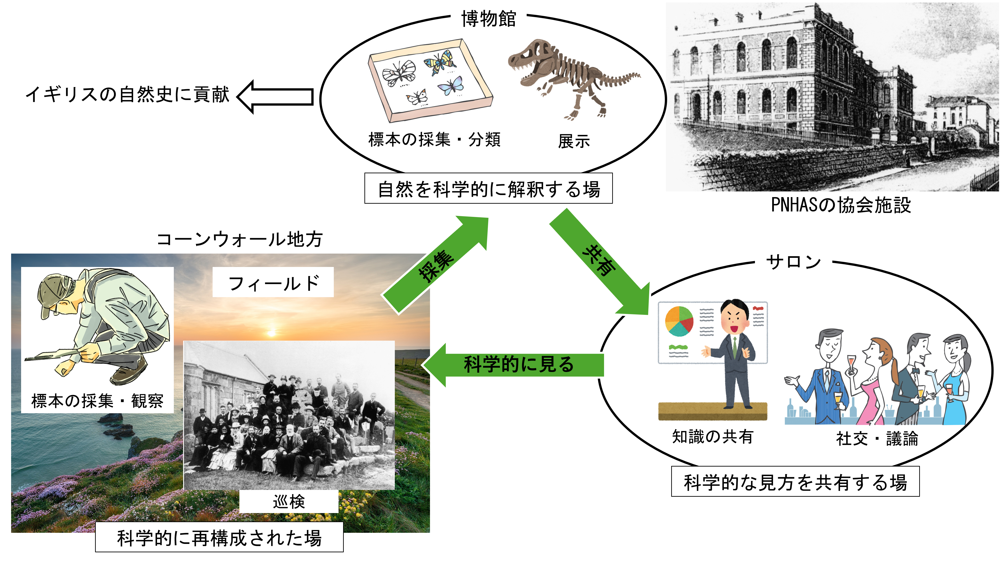
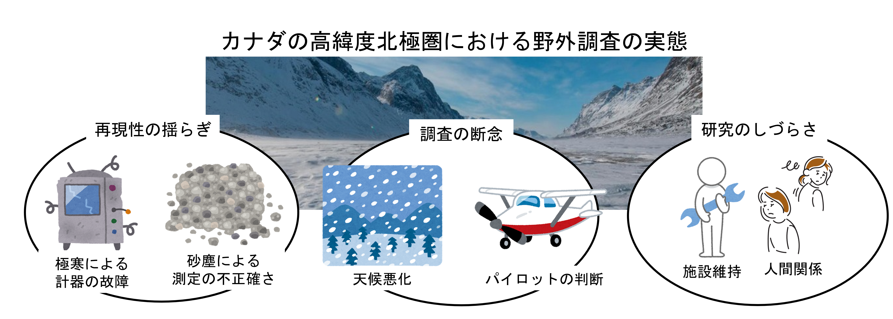

# 科学の地理学の展開と課題

－ 科学実践に着目して －

 
 

東京都立大学
都市環境科学研究科 地理環境学域　都市・人文地理学研究室

修士1年　大塚静空

---

## 発表内容

1. 背景と目的
   - 日本の科学力の現状
   - 空間的視点への関心の高まり
   - 本発表の目的
2. 科学の地理学の成立経緯
   - 1980年代～1990年代
   - 1995年～2003年
   - 2007年～2010年
3. 科学実践に関する研究事例
   - 歴史事例を基にした研究：Naylor（2003）
   - 北極圏の研究：Powell（2007）
   - 火山観測所の研究：Donovan and Oppenheimer（2015）
4. 課題と展望

<!--  -->

---

## 日本の科学力の現状

### 科学力の低下

- 日本の科学力は年々低下している。
- 科学技術指標2025では25ヶ国中13位

引用：科学技術・学術政策研究所　2025．科学技術指標2025．142-145．

<!--
[ToDo]
- PowerPointでNatureの画像を挿入する
- 口頭でNatureは言及する
 -->

---

## 日本の科学に関する現状

### 科学力低下の要因

（Ex）

- 若手研究者の不足
- 雇用・労働問題
- 研究時間の不足

etc...

**⇒科学と社会は切っても切り離せない関係となっている。**

 

こうした要因の実態・改善・対策などに関する議論は進んでいるが、それらには**空間的視点**が欠けている。

<!--
[ToDo]
研究時間の資料を挿入しておく
 -->

---

実験や調査、論文の執筆といった活動は、**どこかでおこなわれている**

⇒空間的な視点から科学を議論することは必要

### 欧米での空間的視点への関心の高まり

欧米のサイエンス・スタディーズの議論の一つとして
科学知識の生産などにおいて**空間や場所も重要な要素**であると注目を集めている。
⇒このような議論から、**科学の地理学**と呼ばれる分野が発展している

 

日本では発展途上の分野であるが、科学を地理学的に捉えるというのは日本の科学に関する現状を考える上でも有用な視点ではないか

---

## 本発表の目的

- 科学の地理学の成立経緯を概観する
- 基礎概念の一つである科学実践に関する研究事例を整理する
- 分野内の課題を挙げ、今後の展望を述べる

<!--
### 留意点
科学の地理学は**科学を否定するものではなく**、**科学という活動を理解する**研究である。 -->

---

## 科学の地理学の成立経緯など

---

### 1980年～1990年代

- **科学知識の社会学（Sociology of Scientific Knowledge（以後、SSK））** における空間的視点への関心の高まり
- SSKは歴史資料を基にしたイデオロギー分析が主流であった

 

（例）近代の実験科学の発展には、**紳士の邸宅**が必要であった（Ophir and Shapin　1991）

当時の実験科学は錬金術と混同されており、
**邸宅内で生産された実験知識の信頼性をどのように確保すべきか**？
↓
実験の目撃者を用意
↓
目撃者の信頼性を保つため、
**邸宅内は紳士的振舞い（嘘をつかない、合理的な議論ができる）をする場所**とした

---

### 1995年

- イギリスの地理学者 D.N．Livingstone が科学の地理学を提唱
- 論文「**The Spaces of Knowledge: Contributions towards a Historical Geography of Science**」
- サイエンス・スタディーズにおける代表的な著作を基に、科学知識と場所の関係性を検討したもの（リヴィングストン 2014：242、Meusburger et.al. 2010：x）。

### 2003年

- D.N．Livingstoneが
『**Putting Science in its Place : Geographies of Scientific Knowledge**』を出版
→2014年に邦訳が出版される
- 主に近代科学の**歴史事例**を基に議論を展開
- **科学の地理学における代表的な文献**

---

### Livingstoneが提唱した科学の地理学の特徴

- **歴史地理学の性格が強い**
  - 本人が歴史地理学の研究者である
  - SSKの代表的な研究者であるSteven Shapinとの交流によって影響を受ける（リヴィングストン 2014）
- このような特徴から、**Historical Geography of Science** と称されることもある

---

### 2007年

- Richard C. Powell による批判
- 論文「**Geographies of Science :histories, localities, practices, futures**」
  - 科学知識の流通や受容だけでなく、
**実際の現場でおこなわれる科学実践も重視すべきだと指摘**
  - **歴史地理学的なアプローチへの偏りを批判**
→様々なアプローチを取り入れて科学の地理学の**理論的・方法論的拡張**をすべき

### 2010年

- P. Meusburger、D.N. Livingstone、H. Jöns らが編者となり
『**Geographies of Science**』を出版
- 地理学や科学史だけでなく、人類学や建築学といった**多様な視点から科学の地理学を探究**

<!-- 科学の地理学の成立や科学社会学との関係性についてレビューし，その上で今後の科学の地理学のあり方について言及した。 -->

---

## 科学実践に関する研究事例

### 科学実践（Scientific Practice）とは

- 知識生産に関する活動や行動のこと。

        

---

### 科学実践に関する研究の傾向

科学実践に関する研究の多くは、**その空間内における科学実践がどのように構成・構築されているのか**を分析したものである。

---

### 歴史事例を基にした研究：Naylor（2003）

- 19世紀のイギリス・コーンウォール地方における**ペンザンス自然史・古物研究協会（PNHAS）の科学実践**を分析

<!--            -->

<!-- PNHASの科学実践におけいて3つの空間が役割を果たしていたという。

- 博物館：標本収蔵・分類・展示 →**自然を科学的に再構成する場**
- 講演会：発表・議論・社交 →**知識の共有と普及をおこなうサロンのような場**
- フィールド：観察・採集・巡見 →**標本収集だけでなくレジャー・教育の場**

フィールド→博物館→講演会→フィールド…と**循環的に繰り返され、次第にフィールドへの見方は科学的になっていく**。

Naylor, S．2003．The field, the museum and the lecture hall: the spaces of natural history in Victorian Cornwall．Transactions of the Institute of British Geographers 27（4）: 494-513． -->

---

### 北極圏の研究：Powell（2007）

- カナダの高緯度北極圏の野外調査を対象に、**実験や調査が場所によってどのように変質するか**を分析
- **政府資料、研究者のフィールドノートや日記**といった資料と**当時の研究者へのインタビュー**

<!--            -->

<!--
- 極寒による機器の故障
- 天候悪化による調査の断念
- 砂塵の混入による純粋な氷の測定の不正確さ

場所の状況によって、実験の前提条件である**再現性が揺らぐ**ことを明らかにした。

また、調査地点への移動は小型機に依存しており、**そのパイロットの判断によって調査計画が左右されていた**ことや、料理やテント設営といった**施設維持**、性格の不一致といった**人間関係による研究時間の縮小**といった実情を明らかにした。

Powell, R.C．2007b．“The Rigours of an Arctic Experiment”: The Precarious Authority of Field Practices in the Canadian High Arctic, 1958–1970．Environment and Planning A: Economy and Space 39（8）：1794-1811. -->

---

### 火山観測所の研究：Donovan and Oppenheimer（2015）

- カリブ海にあるモントセラト火山観測所における科学実践の実態を分析
- 主に**火山観測所の職員と協力関係にある大学教員や地元住民などを対象にインタビュー**

          

<!--
- 社会的責任：火山の監視や緊急対応、地域の安全や政府への提言
- 学術的研究：データの分析や論文の執筆、自身のキャリア

監視をおこなう者としてのプレッシャーと研究者としての自身のキャリアの遅れという**2つの葛藤が火山観測所の科学実践を構成している**。

Donovan, A. and Oppenheimer, C．2015．At the Mercy of the Mountain? Field Stations and the Culture of Volcanology．Environment and Planning A: Economy and Space 47（1）：156-171. -->

---

### 科学実践に関する研究のまとめ

こうした科学実践に関する研究は、**その空間内における科学実践がどのように構成・構築されているのか**を分析したものが多い。

---

## 課題と展望

科学の地理学や科学実践に関する研究には主に3つの課題が挙げられる

1. **研究者や研究事例の欧米への偏り**
   - 科学を地理学的に捉えるのであれば、非欧米圏に関する事例も研究する必要がある。
2. **歴史事例への偏重**
   - 現在の科学実践の実態を空間的視点で調査した研究はいまだに少ない
   - SSKと同様の批判：資料のつなぎ方次第で影響力の強弱を決められる（松本 2021）
3. **研究者の日常への関心の不足**
   - 従来の研究：特殊な環境下での科学実践
   - 研究者の**日常生活の中でおこなわれる科学実践**の研究が不足

以上の検討を踏まえ、
今後は日本の研究現場においても、**研究者が日々の生活の中で直面する空間的制約**がいかに知識生産を規定しているのかを実証的に検討することが求められる。

---

# ご清聴ありがとうございました。
<!--
1. Powell, R.C.　2007a，Geographies of science: histories, localities, practices, futures．Progress in human Geography 31(3)：309-329．
2. Powell, R.C．2007b．“The Rigours of an Arctic Experiment”: The Precarious Authority of Field Practices in the Canadian High Arctic, 1958–1970．Environment and Planning A: Economy and Space 39（8）：1794-1811.
3. Donovan, A. and Oppenheimer, C．2015．At the Mercy of the Mountain? Field Stations and the Culture of Volcanology．Environment and Planning A: Economy and Space 47（1）：156-171.
4. Naylor, S．2003．The field, the museum and the lecture hall: the spaces of natural history in Victorian Cornwall．Transactions of the Institute of British Geographers 27（4）: 494-513．
5. Meusburger, P. , Livingstone, D.N. and Jöns, H.　2010．『Geographies of Science』．Springer Science & Business Media．
6. Ophir, A. and Shapin, S.　The Place of Knowledge A Methodological Survey．Science in Context. 1991;4(1):3-22.
7. 科学技術・学術政策研究所　2025．科学技術指標2025 142-145．
8. 松本三和夫 編　2021．『科学社会学』，東京大学出版会．
9. デイヴィッド・リヴィングストン著，梶雅範・山田俊弘訳　2014．『科学の地理学　場所が問題となるとき』．法政大学出版局．
-->