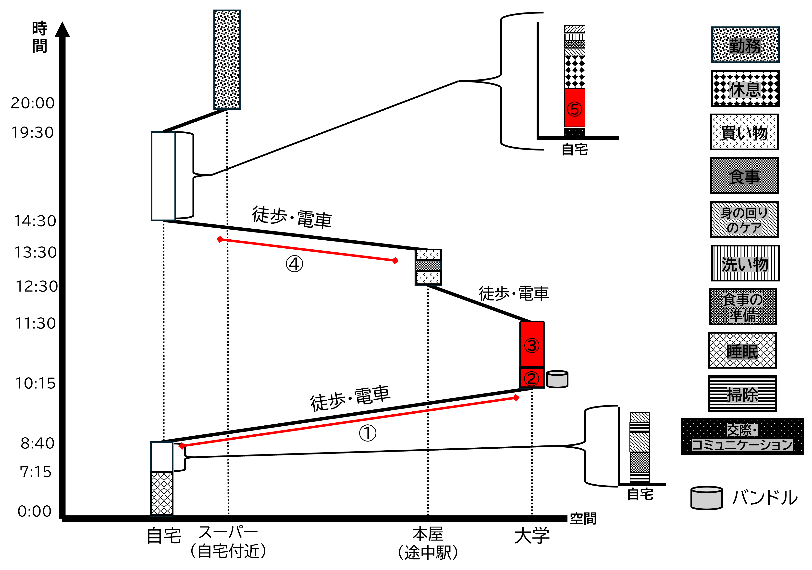
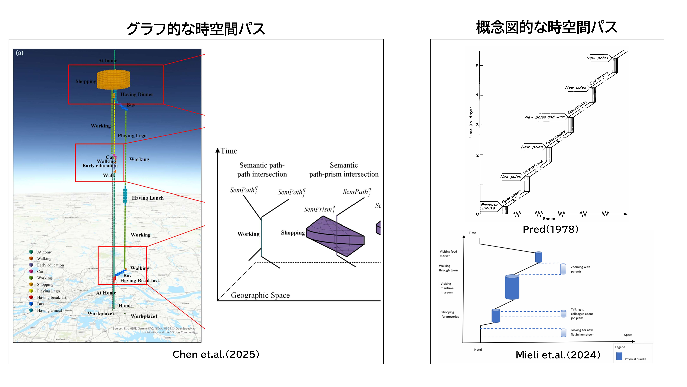
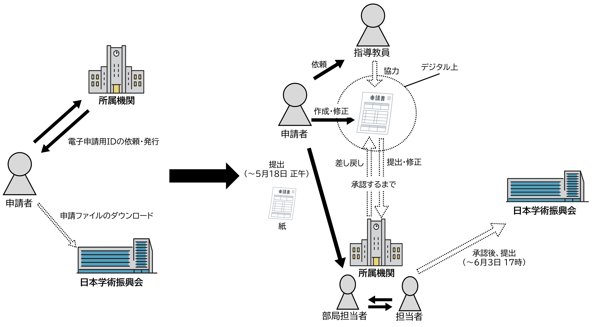

# 日常生活に埋め込まれた科学実践の時空間構造

**―時間地理学を用いた探索的研究　大学院生を事例に―**

大塚静空　（M2）

---

## 発表内容

1. 調査票の中身
2. 現状の調査の過程
3. 2026年5月18日の時空間パス

---

## 調査票の中身

### 調査期間

- 6月1日から7月12日
  - 自身が最も忙しいと感じる1週間を選択
  - その期間中の行動を**15分単位で記録**

### 「忙しさ」について

- 今回は、**個人の主観を優先**し、明確な定義をしていない
  - 忙しさが研究分野・研究スタイル・生活状況によって大きく異なるのでは
    - 画一的な基準を設定すると実態を捉えることが難しくなると判断
  - 協力者間で**忙しさの理由が共通であった場合**
    - 同組織に属しているため、制度的・構造的な要因が生活を規定するということの表れと解釈することができる？

---

### 生活日誌について

- 行動の書き方
  - 通常の活動の場合は、「**行動内容（場所or移動手段）**」
    - 例：昼食を取る（自宅）
  - 研究活動の場合は、「**何で研究活動（場所or移動手段）**」
    - 例：PCでゼミ発表の準備のためのスライド作成（大学）
  - 同じ行動が続く場合は、**終了時刻の枠まで矢印を引く**
  - 枠内で行動が切り替わる場合は、「**行動内容　～終了時刻／　行動内容（場所）**」
    - 例：洗濯物を干す ~12:02 / 着替え（自宅）
      - 可能であれば終了時刻を付してもらう
- 【備考】**行動は開始時刻から最も近い枠に記入**
  - 12:10に昼食を取る→12:15の枠に記入
  - 13:42にデータを分析する→13:45の枠に記入

---

- 記入する枠
  - **［主に何をしていましたか（場所）］**
    - その時間帯で中心的に行っていた行動を記入
    - できるだけ「何をしていたか」が分かるように書いてもらう
      - 「作業」→ ×
      - 「PCでゼミ発表の準備のためのスライド作成」→ ○
  - **［同時に他に何をしていましたか（場所）］**
    - ながら行動（同時に行っていた行動）について記入
      - 電車で移動しながら、スマホで論文を読んでいる場合
        - 「スマホで論文を読む」とする

---

- 行った空間の書き方
  - 行動を行っていた**大まかな空間**（自宅・大学・カフェなど）を、**ある程度の位置関係が分かるように**記入
    - 買い物（コンビニ）→ ×
    - 買い物（自宅の近くのコンビニ）→ ○
    ―――――――――――――――――――――
    - 立ち読み（渋谷駅の本屋）→ ○
    - 立ち読み（途中駅の本屋）→ ○
  　　　　　※駅名が分からない場合など
  - **行動する空間が変わったときのみ記入**
  - 可能であれば、大学内は具体的に記入してもらう
    - 例：自身の研究室・他の研究室・実験室など
  - **議論の余地あり**

---

- 日常的な活動に関して
  - **社会生活基本調査（B）の記入方法を基に設計**
    - 起床・就寝・帰宅などの一時点の行動は記録対象外
    - 移動に関する行動は、どのような目的で移動したかが分かるように記入
      - 「大学へ行く（電車）」
      - 「バイトへ行く（徒歩）」
    - 休憩や休息に関する行動は、ある程度具体的に記入
      - 「スマホでYoutubeを見る（自宅）」
    - コミュニケーションや交際に関する行動なども同様
      - 「友達とLINEで話す（自宅）」

---

- 属性情報として
  - 氏名
  - 学年
  - 所属
  - 分野
    - 自然科学か人文社会科学か
  - 具体的な研究分野
    - 第四紀学，気象学，社会地理学など
  - 主な研究方法
    - 実験，フィールドワーク，データ解析，インタビューなど
  - 聞き取り調査の可否

---

### アンケート調査について

- 質問数は5つ
- 大きく二つの項目で構成

#### 進路関連

- 卒業後の進路（選択式）
  - 就職・進学（内部）・進学（外部）・未定・その他
- その進路に向けて現在行っている活動（自由記述）
  - 例：インターン、企業説明会への参加、論文投稿、英語学習など
- 記入期間中に上記の活動で行っていたものを挙げてもらう（自由記述）

---

#### 生活日誌関連

- **研究活動の捉え方の曖昧さの把握**
  - 「研究として書くか迷った行動」や、「記録しなかったが研究に関係していた可能性のある行動」を挙げてもらう
  - 研究活動が日常生活にどのように埋め込まれているかを理解する上で重要な情報
- **生活日誌の改善点**
  - 生活日誌の記入において困った点や改善点を自由記述で回答してもらう
    - 調査手法の改善に役立てる

---

## 調査の過程

### 現在は調査中

---

#### 本当に忙しいのであれば，1日の記録をつけるという行動はそもそも出来ない

- 2つの返答は今回の生活日誌調査において忙しい週を選択するという点と相反？
- 社会生活と科学実践の連続性が最も密に表れる時期の指標としての「忙しさ」
- 単に聞き方の問題かもしれないが，今後の調査において重要な知見

---

### 現時点で回収数は3件

- 内容はまだ詳細に見ていない
  - 現時点では調査に関してあまり言えない
- 配布の際にどのような週を選ぶかを軽く聞いてみたら（非公式）
  - **多くが自身のゼミ発表の準備を行う週**であると回答
    - 協力者間の多くで忙しさの理由が共通している点は興味深い
    - 特定の組織に属していることで、その組織の制度的・構造的な要因が時空間を規定するという解釈に繋がる？

---

## 2026年5月18日の時空間パス

### 自身の生活の時空間パスを作成

- パイロットテストとして自身で1日分の生活日誌を記入
  - それを基に**時空間パスを作成**
- この日を選んだ理由
  - 学術振興会の特別研究員（以下、学振）の申請書を大学側に提出しなければならない日だった
  - 提出期限は5月18日の正午まで
    - それに間に合わせるよう大学へ行っている→時空間的な調整

---

---

### 理論的な時間地理学について

#### 時間地理学は多様なアプローチを取っている

- 櫛谷（1985）の研究
  - 時間地理学の興隆期である1970年代から1980年代における動向について整理
  - 当時の時間地理学を4つの関心に分ける
  1. 個人の一定時間内で到達可能な範囲を把握するなどの技術的な研究
  2. 個人を中心としてその周囲の自然的・社会的環境とのかかわり合い方を問題にした研究
  3. 生活史研究を基にした生活条件による影響を分析した研究
  4. Giddensの構造化理論と関連した社会理論をベースとした研究

---

#### 時間地理学における近年の傾向

- **技術的な側面が強い**
  - GISやビックデータを使用した時空間分析や多変量解析による研究
    - 中国や台湾などのアジア圏が積極的に取り組んでいる（Chen et.al.　2026）
- **理論的な研究なども**少なからず行われている（Mieli et.al.　2024）。

#### アプローチ（又は視点？）を選択する必要がある

- 時間地理学は画一的なものではなく，多様な視点から行われているもの
- ひとえに時間地理学の枠組みを採用するといっても，どのようなアプローチで行うのかを選択する必要がある

----

#### 理論的なアプローチの採用

- 特に**Predなどに代表される構造化理論を基盤としたもの**
  - 社会と個人は**相互関係**であり、制約は相互作用的に構成されたもの
    - 社会が個人の時空間に対して制約を課すといった一方的な関係→×
  - **社会は様々な個人の時空間で構成されている**
    - 個々人の時空間は互いに関係しあっている
    - 一見関係のない人の時空間においても実際には関係している
  - 時間地理学以外の社会理論や概念を**補足的に用いるべき**としている

---

  - Pred（1978）
    - イノベーションの普及が個人の生活を変容させ、社会状況をも変化させる
    - アメリカにおける電信の普及を事例
      - 新たなイノベーションによって新たな職業が創出される
        - 個々の雇用の変動が連鎖的に発生する
      - 電信メッセージの送受信
        - 一人の行動ではなく、多人数、複数の場所・多資源を連鎖的に結びつけるプロジェクト
    - Predのような視点は制約を善悪の判断を行うものとして捉えるのではなく、生活の構成要素の一つとして記述している

---

---

---

では、こうした理論的な視点は日常的な科学実践を捉える研究においてなぜ有用なのであるのか。
最も重要な点であるにもかかわらず、現状説明がうまくまとまっていないため、今回の発表では省略させていただく。

申し訳ありません。

---

#### 時空間パスの違い

- 時空間パスにおいてもアプローチによって違いがある（主に2つに分類できる）
- **グラフ的な時空間パス**
  - 数値の可視化が前提
  - プリズムといった時空間パスそのものが幾何学的な分析を可能としている
  - 主に技術的な時間地理学の研究で使用される
- **概念図的な時空間パス**
  - 生活の流れや社会関係を抽象的に可視化したものとして用いられる
  - 2次元のものが多く、比較的表現が自由
  - 主に理論的な研究や個人史などの具体的な位置を表記しにくい研究で用いられる
- **本研究は概念的な時空間パス**を用いる
  - 理論的なアプローチ
  - 回答者が少数

---

---

#### 時間地理学の長年の課題：デジタル化

- デジタル活動をどのように捉え、時空間パスとして表現するのか
  - 長年議論が続いているものの、一向に解決することがない
- 本研究においても問題となるところだが、**現在は検討中**
  - ただ、Predのようなアプローチの場合、必然的に時間地理学以外の社会理論や概念を補足的に用いるため、理論的な貢献はできそうかも？

---

### 実際に解釈してみる

#### 学振の申請書の提出という科学実践

- 大きく二つの時間地理学的な解釈が可能？
  - 大学への提出という科学実践は大学独自のバンドルを形成している
  - 自身の生涯パスを形成するために行われている日常的な科学実践である

---

---

#### バンドルとしての大学独自の科学実践

- 学振のシステム（図2）
  - 承認方法や期限等は各大学に任されている
  - 当大学の場合：
    - 5月18日の正午までに紙媒体での提出
    - 修正等を繰り返す
    - 申請受付の期限である6月3日の17時までに承認する形
  - 窓口への提出は、当大学独自の制度（又は慣習？）によって生まれる科学実践

---

---

- 管理の制約と結合の制約を形成
  - **管理の制約**：
    - 例：施設の開館時間など
    - 今回の場合：窓口が開くのは9時
      - 9時から12時までの間に提出をするよう調整しなければならない
  - **結合の制約**：
    - 申請者（筆者）と窓口の大学職員は物理的に接触する必要
      - バンドルの発生
    - 提出が遅れた場合、それ以降のプロジェクトは阻害ないし中断される

---

---

#### 日常的な科学実践が生涯パスを形成する

- 学振が受理され，採用されれば，博士課程で研究費等が支給される
  - **今回の提出は自己の生涯パスを形成しうる重要な行動**
- 仮に採用された場合（逆も然り）
  - 自己の生涯パスを変容させる
  - 採用されなかった**他者の生涯パスも変容する**
    - バタフライエフェクトなので偏重して議論するものではない…

しかし、自身の行っている日常的な科学実践が自己だけでなく他者の時空間パスにも影響を及ぼしうる点は、時間地理学的にも科学実践研究においても重要な事象

---

## 批判・懸念・感想

- 時空間パスを描きやすいドローイング・ツールが欲しい
  - 現状はPowerPoint
  - 条件：無料、モノクロの図形パターンが豊富
- 科学実践の活動は類型化すべきか、そのままにすべきか
  - 今回はそのままにした
- 1日の時空間パスでこれだけのことを言えるので、49日分（7人×7日）の解釈をするととつもない文量になる
  - 特徴的な事象をかいつまんでいく形にすべきか
- 結果的に科学の地理学が行っていたような科学実践研究に近づいてきた
  - ただなんとなく違いがある気がするが、文章化できてない…

---

- 理論的な時間地理学の具体的な手法・解釈方法が明記されていない
- まだストーリーがバラバラであり、どう繋げていくのかは考えている。
  - 研究の位置づけ（よりよい知識生産など）や時間地理学を科学実践研究に取り入れる意義など
- 研究の進度によっても変わってくる
  - テーマを決める人と分析をする人は行動が異なる
- 時間地理学の先行研究をさらに調べる
- 図1の「バンドル？」は、時間地理学的な解釈をすれば他者との結合の制約であるが、そこでアイデアが生まれたので制約になり得ないのでは？→境界の問題
