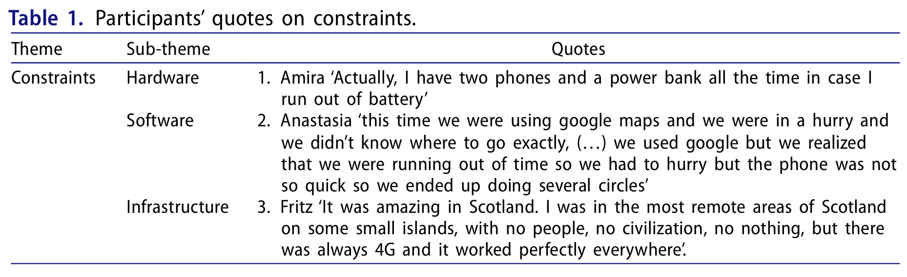
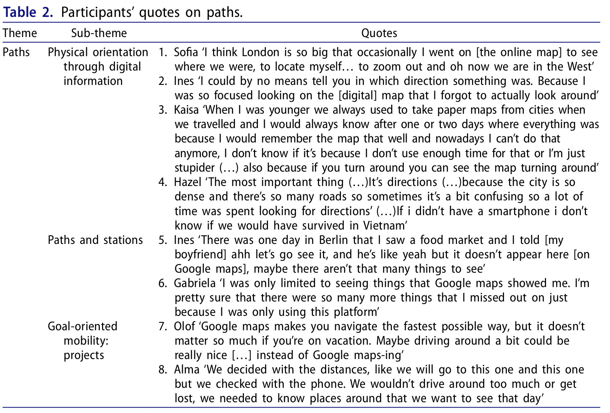
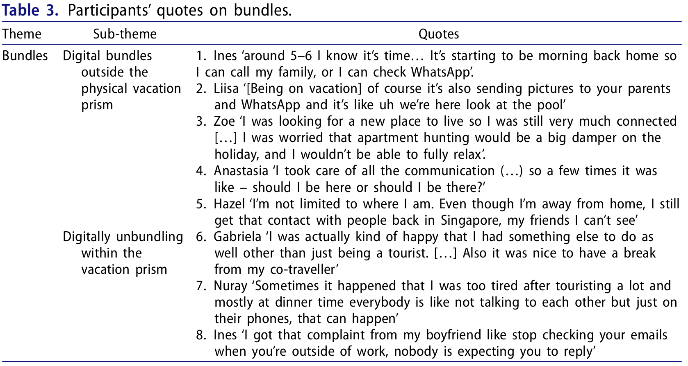

# ２回目　発表

大塚静空

---

## 紹介する論文

**Phygital time geography, or: what about technology in tourists’space-time behaviour?**

### 書誌情報

- 著者：Micol Mieli　Malin Zillinger　Jan-Henrik Nilsson
- 出版年：2024
- 出版元：Tourism Geographies 26(3):389-406

---

### 背景

- **通信技術の発達**、特にスマートフォンの登場により、観光客は**常時接続**の環境が当たり前となった
  - 従来の物理的な**観光行動は大きく変化**している
- 著者らは、物理的空間とデジタル空間が重なり合う「**フィジタリティ（phygitality）**」 という概念を用いて、**従来の時間地理学の枠組みをデジタル化による文脈に再構成しよう**と試みる

---

### 目的

- フィジタルな環境による観光客の行動について説明するために、時間地理学をフィジタルな時間地理学（phygital time geography）として概念化すること
  - 観光分野におけるデジタル化への時間地理学の適応に関する議論に貢献するという意図から、概念的な考察に重点を置く
- スマートフォンを所持する観光客が、その時空間的行動においてデジタル世界と物理世界をどのように統合しているのかを分析する
- 経路（paths）・束（bundles）・制約（constraints）の各概念を少数のインタビューから具体化する

---

### 手法

- 探索的なアプローチを採用し、2019年5月〜2020年3月に実施された大規模研究の一部として、ミレニアル世代（1980–1990年代生まれ）を中心に**15名への半構造化インタビュー**を行う
- 主に**グラウンデッド・セオリー**の手法を用いている
- 分析は3段階のテーマ分析で進められ、最終的に「制約」「経路」「束」の3つの分析テーマを抽出する

- **継続的比較分析**（principle of constant comparison）
1. **インビボ・コーティング**（in vivo coding）
2. テーマの精緻化
3. 時間地理学の概念と結びつけた理論構築

---

### グラウンデッド・セオリーとは？

- 定性的アプローチの一つ
- 事前に仮説を立てず、インタビューや観察などを基にデータ収集し、分析を通じて理論を生成する
  - 所謂データ駆動型
- データをコード化し、それらのコードを基にカテゴリーやテーマを抽出していく
  - コード化：質的データの一部分に意味のある名前や記号を付けること

---

### 継続的比較分析とは？

- 新しいデータを既存のコード・カテゴリーと常に比較しながら分析を進める方法。
- グラウンデッド・セオリーの中核的技法。
- データ同士、データとコード、コードとカテゴリーを絶えず比較し、類似点・相違点を検討することで、概念を洗練させていく。
  - Ex) 3人目のインタビューで「孤独感」というコードを付けた場合
  - 1人目・2人目のデータに戻り、同様の内容がなかったかを確認する。
    - あれば同じコードを付ける
    - なければ3人目の人特有の体験として注目する。

引用元：<https://code-category.tapeokoshi.net/constant-comparison/>

---

### インビボ・コーティングとは？

- グラウンデッド・セオリーの考えかた
- インタビュー対象者が使用した顕著な言葉・用語をコードとして捉えるべき
- 「in vivo（イン・ビボ）」の由来はラテン語で「生体内の」という意味

引用元：<https://www.qdaa.info/in-vivo-coding/>

---

### 結果

#### 制約（Constraints）：表1

- スマホの性能（バッテリー等）・ソフト（アプリ性能）・インフラ（通信網）が新たな能力の制約を生む。充電や電波状況が行動選択に影響する。

---

#### 経路（Paths）：表2

---

- **デジタル情報による物理的な方向性(Physical orientation through digital information）**
  - デジタル地図への依存性が指摘されている
  - 物理的環境＜デジタル地図
    - Ex) 自分の物理的位置を確認するために、デジタル地図を開く

- **フィジタル・ステーション**
  - 位置情報サービス（LBS）を提供するインタラクティブなオンライン地図は、「訪れるべき場所」と「そうでない場所」に関する信頼できる情報源とみなされている
  - →ただし、物理的な要因との交渉はおこなわれる　→フィジタルな空間
- **目的志向型のモビリティ・プロジェクト（Goal-oriented mobility: phygital projects）**
  - デジタルツールは計画の立案や実行において時間と空間を効率的に活用することを可能にする
    - Ex) 乗換案内、ルート検索など
  - さらに、このような効率化された計画はいつでも変更が可能となる
    - →すべてがそうではない

---

### 束（Bundles）：表3

- フィジタルな時空間における観光客は外的な影響と内面的な影響をもたらしている

---

- **デジタル・バンドル**
  - 旅行中でも自宅や職場の人々とデジタルに「束」を作る
    - Ex) 写真共有・チャット・リモート業務
- **デジタル・アバンドリング（Digital unbundling）**
  - 旅行中の同行者間でデジタルの使用により、物理的な関係が緩み、デジタル環境で新たに関係を構築する
    - Ex) 同行者が旅行中にメールをチェックする

---

### 考察

- **フィジタルな時空間**
  - 物理とデジタルは別々のものでなく、融合し、重なり合っている。
  そして、フィジタルな時空間構造が生まれる。
    - →**時間地理学の存在論的前提を再検討する必要がある**
- **フィジタルな時間地理学：図2**
  - フィジタルな環境においても時間地理学の諸概念は適用できるが、**再検討が必要**
- **観光の非日常性の弱まり**
　  - 常時接続な状況において、観光行動をしながら仕事のメールをチェックすることもできる。また、効率化された経路による偶発性の欠如といったことが挙げられる。
  - それゆえに、**観光は日常から脱却した活動ではなくなっている**。

---

## +α　最近の時間地理学のトレンド

### 主な特徴

- 定量的なアプローチ
- 技術的な側面が強い
- ビックデータを使用した時空間分析・多変量解析
- デジタル活動をどのように時空間パスとして表現するのかを模索
- 中国・台湾などが積極的

---

### 読んでいる文献

**Semantic Time Geography: Bringing Semantic Contexts to Notation System of Time Geography**

#### 書誌情報

- 著者：Chen, B. Y.・Zhang, Y.・Luo, Y.・Wang, D.・Gong, J.
- 出版年：2025
- 出版元：Annals of the American Association of Geographers 116(1):75–101.

#### 現時点で分かること

- 最近の時間地理学の典型的な研究
- データは武漢市のコロナ禍中の活動日誌のデータ（44名）と、それを基にシュミレーションされた行動データ（10,970名・5,000世帯）
- グラフと数式が多い

---

## 感想

- Mieli（2024）は最近の時間地理学のトレンドに沿っていないものの、古典的な時間地理学のアプローチの一つであった理論研究が現在でも行われていることを示す研究である
- 国内外問わず観光分野において時間地理学が再評価されている
- 少人数の質的調査を行っているという点は自身の研究手法と似ている
- フィジタルという用語で昨今のデジタル環境を説明するのは良い方法かもしれない
- 最後の概念図は少し無理があるような気がする

---

### Predの論文と比較して

- Mieli（2024）では個人の観光行動を規定する要因（特にデジタル技術）について分類し、時間地理学の概念に当てはめて説明をしていた
- しかし、その要因そのものがどんな条件や制度、慣習等と結びついているのかについては**詳細に説明していない**。
  - Ex) Wi-Fiのような通信環境が整っていない場合
    - Mieli（2024）ではそれが単に要因の一つにある又は制約の一つである、という記述に留まっている。
- Predが行っていたアプローチは**個人の生活を規定する社会状況や構造の把握が重要な視点**となっている。
  - Ex) Wi-Fiのような通信環境が整っていない場合、
    - Predのアプローチでは通信環境が整っていない要因にまで踏み込んで説明する。例えば、経営状況等が要因になり、施設の経営といった社会状況が個人の生活を規定しているというような説明になる。

---

- その土地、組織、集団における実情を含めて分析している
  - Mieliの研究ではインタビューによって個人の側面は把握できているため、資料等でその要因についてさらに詳細に記述する必要がある
  - →インタビュー＋資料分析

---

- 焦点を変えて最近の時間地理学のトレンドとPredの研究を比較すると、やはりこちらも社会の側面については詳細に説明されていないのが現状である。古典的な文献の軽視？
  - 時空間パスの使われ方にも違いがある。
    - PredやMieliの研究　→概念図
    - 最近のトレンド　→グラフ
  - 概念図的な時空間パスは、生活の流れを可視化したものとして用いられている。主に2次元での可視化が多く、絶対的な空間でないため、比較的表現が自由である点も特徴である。
  - グラフ的な時空間パスは、数値の可視化が前提にあり、また時空間パスそのものが幾何学的な分析を可能としている点も特徴である。

