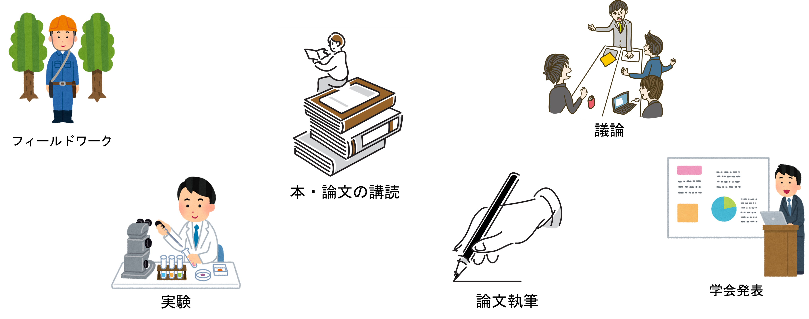
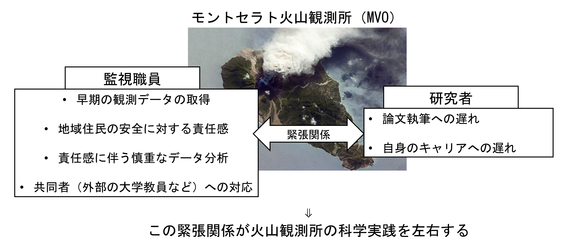

# 日常生活に埋め込まれた科学実践の時空間構造
―時間地理学を用いた探索的研究―
大塚 静空（M2）

---

## 前回のあらすじ

### 科学の地理学の歴史を説明

説明しただけ

---

## 発表内容

- Ⅰ. はじめに
- Ⅱ. 科学実践を扱った研究の整理
  - 実験室研究
  - 科学の地理学
  - 共通する課題
- Ⅲ. 研究の目的・調査計画
  - 研究目的
  - 研究課題
  - 調査計画

---

# Ⅰ.はじめに

---

近年，日本では科学力の低下が問題となっている。その要因には，若手研究者の減少や雇用問題，研究時間の不足，ジェンダーなど様々な社会的な問題を含んでいる。最近では，このような問題が顕在化し，議論されている。しかし，こうした議論において地理学的な視点が欠けている。実験室やフィールド，研究室といった空間・場所がなければ科学を行うことはできない。そのため，科学を対象とした地理学的研究は可能であり，日本の現状を考える上でも必要である。

---

### 科学力の低下

- 日本の科学力は年々低下している。
- 科学技術指標2025では25ヶ国中13位

引用：科学技術・学術政策研究所　2025．科学技術指標2025．142-145．

---

### 科学力低下の要因

（Ex）

- 若手研究者の不足
- 雇用・労働問題
- 研究時間の不足

etc...

**⇒科学と社会は切っても切り離せない関係となっている。**

 

こうした要因の実態・改善・対策などに関する議論は進んでいるが、それらには**空間的視点**が欠けている。

<!--
[ToDo]
研究時間の資料を挿入しておく
 -->

---

地理学において科学を直接対象とする研究はほとんど存在しないが，科学に関連した事象を扱う研究は一定数みられる。例えば，水野（2005）では，イノベーションを産業集積論や都市論から検討するイノベーションの地理学について整理している。さらに，中川ほか（1992）や加藤（2004）のような学園都市を対象に研究開発機能の立地や研究者の移動と集積を分析する研究もある。このような部分的に科学を対象としている研究は存在している。しかし，こうした研究は科学の空間的な性質を明らかにするというよりも，経済発展を目的としている。また，研究の多くはマクロ・メゾスケールであり，ミクロスケールでの研究は管見の限り見られなかった。

---

とはいえ，地理学的な視点から科学を対象とする研究は存在しないわけではない。欧米では，科学の地理学という分野が存在する。前回の発表では，成立背景や経緯，それに関わる周辺領域との関係を説明したため，具体的な内容は割愛する。この分野の課題として，今現在の科学実践を対象とした研究が不足していることが挙げられる。

---

### 科学実践（Scientific Practice）とは

- 知識生産に関する活動や行動のこと。

---

科学実践を扱った研究は主に科学技術社会論（STS）で行われている。しかし，先述したミクロスケールでの研究が欠如している点と科学の地理学における課題を考慮するのであれば，地理学的に科学実践を分析することは不可欠である。

---

# Ⅱ. 科学実践を扱った研究の整理

---

## 実験室研究

- 1980年代に勃興
- 実験室の中に社会学者がはいり，そこで行われている研究者の日常的な行動を記述していく
- 目的：知識の構築（生産）のプロセスを明らかにする
- 主な手法：エスノグラフィー

---

### 『ラボラトリー・ライフ』

- 著者
  - ブリュノ・ラトゥール
  - スティーブ・ウール―ガー
- 出版年
  - 初版：1979年
  - ２版：1986年

---

### 『ラボラトリー・ライフ』

- 1970年頃のアメリカのソーク研究所の神経内分泌を研究する実験室に長期間のエスノグラフィーを行う
- 目的・関心
  - 実験室の中で営まれる科学者の日々の活動がどのようにして科学知識の構築につながるのか
- 非人間も知識構築の重要なアクター
  - 研究者である人間
  - 論文やメモといった描出物
  - コンピューターやタイプライターといった描出装置
- それらが相互に関係を持ち，ネットワークを構築している→ANTへ
- こうしたアプローチは一定の蓄積が進んでおり，現在ではラボのみを対象としても新たな学問的発見が少ないと指摘（三菱総合研究所 2020）。

---

### 実験室研究の近年の動向

多様な視点での分析が行われている（Stephens・Lewis 2017）。

- 拡張された実験室（extended laboratory）
  - 動物舎や臨床現場，データ解析室など対象を拡張
- 科学者の相互作用（interaction order）
  - 専門用語の使い分けや誰が発言を支配するかなどを分析
- 感覚民族誌（sensory ethnography）
  - 実験室の匂いや温度による実践への影響などを分析

---

## 科学の地理学

- Powell（2007a）の批判以降，科学実践を対象とされるように
- 科学実践を地理学的に理解するための重要なアプローチ
- 目的
  - 科学実践が特定の空間的・環境的・制度的条件のもとでどのように構成され，可能になっているのか
- 今の科学実践を扱った研究事例は非常に少ないのが現状

---

### Naylor（2003）

- 19世紀のイギリス・コーンウォール地方における**ペンザンス自然史・古物研究協会（PNHAS）の科学実践**を分析

---

### Powell（2007）

- カナダの高緯度北極圏の野外調査を対象に、**実験や調査が場所によってどのように変質するか**を分析

---

### Donovan and Oppenheimer（2015）

- カリブ海にあるモントセラト火山観測所における科学実践の実態を分析

---

## 共通する課題

従来の科学実践研究について整理すると，実験室研究では研究者の実践を基に科学的知識の生産過程を明らかにしてきた。一方で，科学の地理学では知識生産そのものではなく，科学実践がどのような空間的・環境的・制度的条件のもとで可能になるのかを明らかにしてきた。つまり，前者は知識生産のミクロなプロセスに，後者は科学実践を支える空間的諸条件に焦点を当てており，両者は科学実践の異なる側面を扱っている。
しかし，これらの研究はいずれも，科学実践が日常生活にどのように埋め込まれているのか，すなわち家庭のケア，家事，移動，生活リズム，睡眠，その他の仕事といった日常的な活動の中で科学実践がどのように行われているのかは十分に扱われていない。実際，睡眠や食事が確保されなければ研究を続けることはできず，研究室や自宅にしかない資料を参照するためには移動が伴う。また，執筆中に家庭の手伝いや他の業務が入れば作業は中断される。加えて，最近では，研究と生活の折り合いのつけづらさや自身の研究キャリアと家庭との葛藤などが語られ始めている（岩波書店編集部 2024）。
このように，科学実践は日常生活から独立した営みではない。むしろ日常生活を含めた活動の連鎖の一つとして位置付けることができる。言い換えれば，科学実践とは日常生活に埋め込まれた営みとして捉えることができる。仮に科学実践研究を知識生産の議論の範疇に位置づけるとしても，その知識生産を支え，可能にしている睡眠・食事・ケア・家事といった再生産活動はほとんど顧みられていない。

---

# 研究の目的・調査計画

---

## 研究目的

### 本研究における科学実践の位置づけ

科学実践＝日常生活に埋め込まれた営み、日常生活の一部

### 目的

ミクロスケールにおける科学実践がどのような空間構造のもとで成立しているのかを地理学的に明らかにする

---

### 研究課題

#### 方法論的課題

- 既存研究（実験室研究／科学の地理学）には日常生活を捉える枠組みがない
→ 時間地理学を導入し、科学実践を活動の連鎖として把握する方法論を探索

#### 実証的課題

- 上記の枠組みを用いてミクロスケールの科学実践の時空間構造を記述・分析する

---

### 調査計画

#### 対象者

- 日常的に研究活動を行う大学院生
- 研究室・ゼミを通じて募集
- 探索的研究のため 3〜5 名を想定

#### 調査内容

- 1週間の生活日誌（研究活動が生活の中でどう位置づくかを把握）

---

### 生活日誌の作成

- 記録方式：アフターコード方式
  - 総務省「社会生活基本調査」の調査票Bを参考に作成
- 入れる要素
  - 時刻（15分単位）
  - 場所（自宅，研究室，図書館，カフェ等）
  - 行動内容（自由記述）
- ※ 記入方法・例は説明書で提示する予定

---

### アンケート調査
- 記録の迷い・抜け落ちを補うための調査
  - 「研究として書くか迷った行動」
  - 「日誌に書かなかったが研究に関係した可能性のある行動」
  - 「記録で困った点・迷った点」
- ※ 記入方法・例は説明書で提示する予定

---

### インタビュー調査

- 目的：生活日誌の背景を理解する
  - 生活構造
  - 研究の進め方
  - 研究場所の選択理由
  - 生活上の制約
- 時間：30〜60分

---

### 分析方法

- 時空間パスの作成
  - 1週間の生活日誌から科学実践と生活行動の時間配分・場所の分布を可視化

- 制約概念による分析（時間地理学）
  - 能力の制約（利用できる資源・技能）
  - 結合の制約（他者・設備との同期）
  - 権威の制約（制度・規則による制限）
→ 科学実践が“どの条件のもとで可能になるのか”を読み解く中心枠組み

---

### 分析方法

- 科学実践の境界の把握
  - 生活日誌・アンケート・インタビューを照合
  - 記録された／されなかった行動
  - 迷いが生じた行動のパターン
→ 科学実践の“境界”を明らかにする

- 方法論の検討
  - 生活日誌で 研究活動の連続性をどこまで再構成できるか を評価
  - 記述方法の有効性を検討
  - 今後の調査枠組みの改善点 を考察

---

### 倫理的配慮

- 参加は完全に任意（いつでも中止可能）
- 個人情報は匿名化し、研究目的以外には使用しない
- 特定につながる情報は記録しない（研究室名・指導教員名・具体的テーマなど）
- データは厳重に管理（パスワード保護）
- 公表時は A〜Z の記号で匿名化